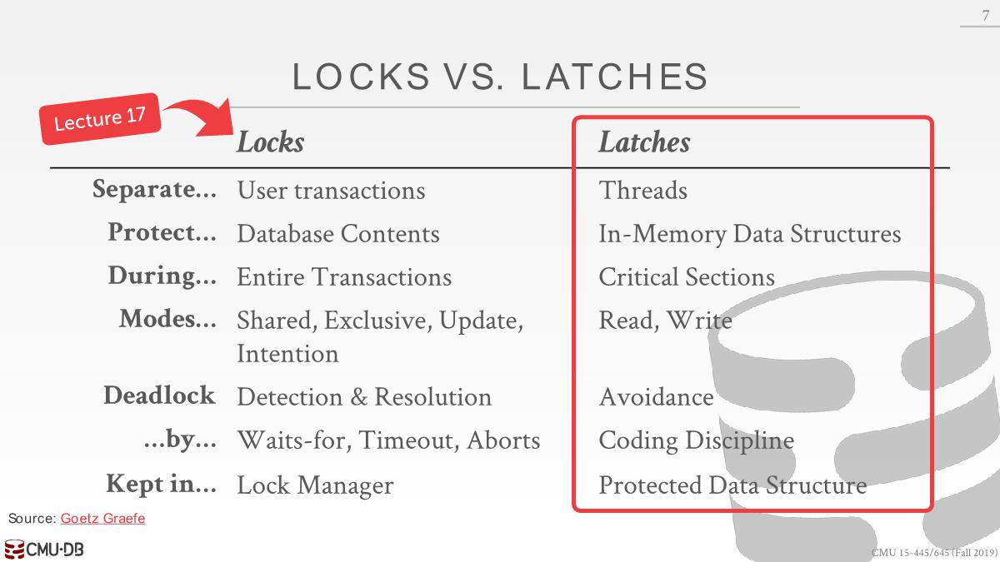
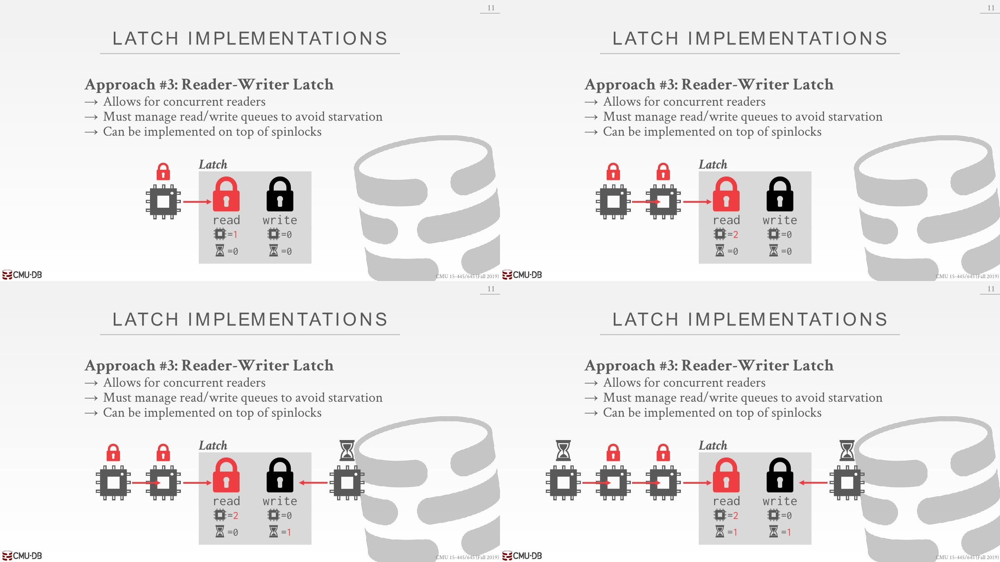
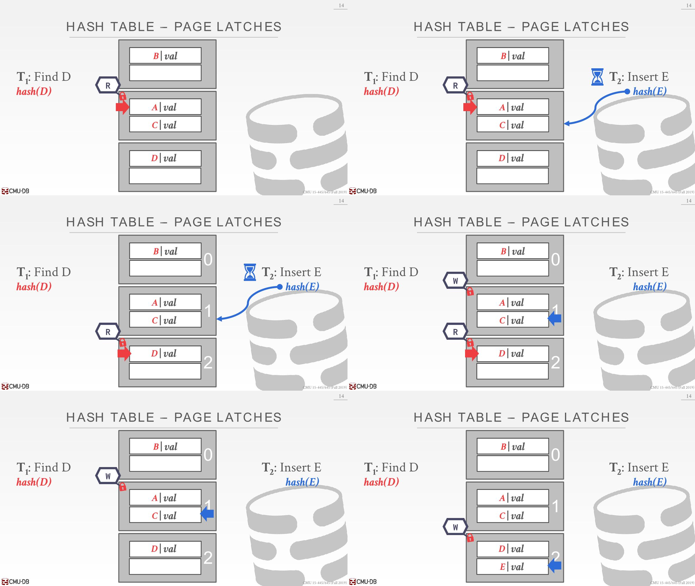
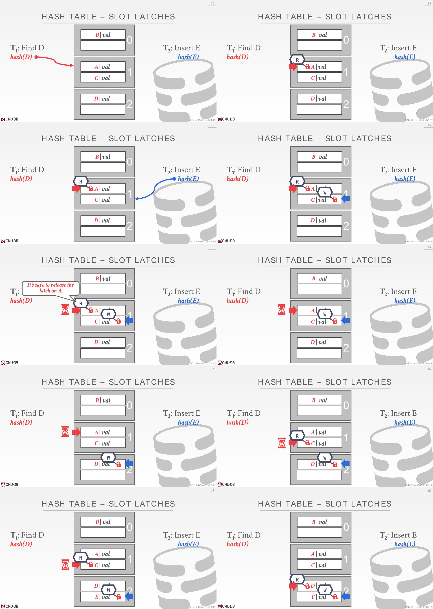
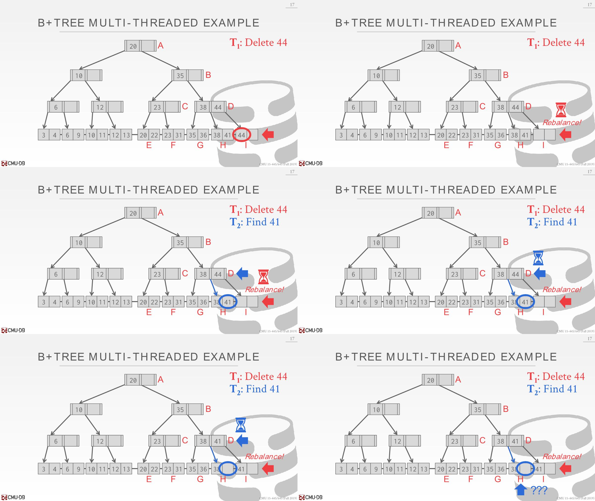
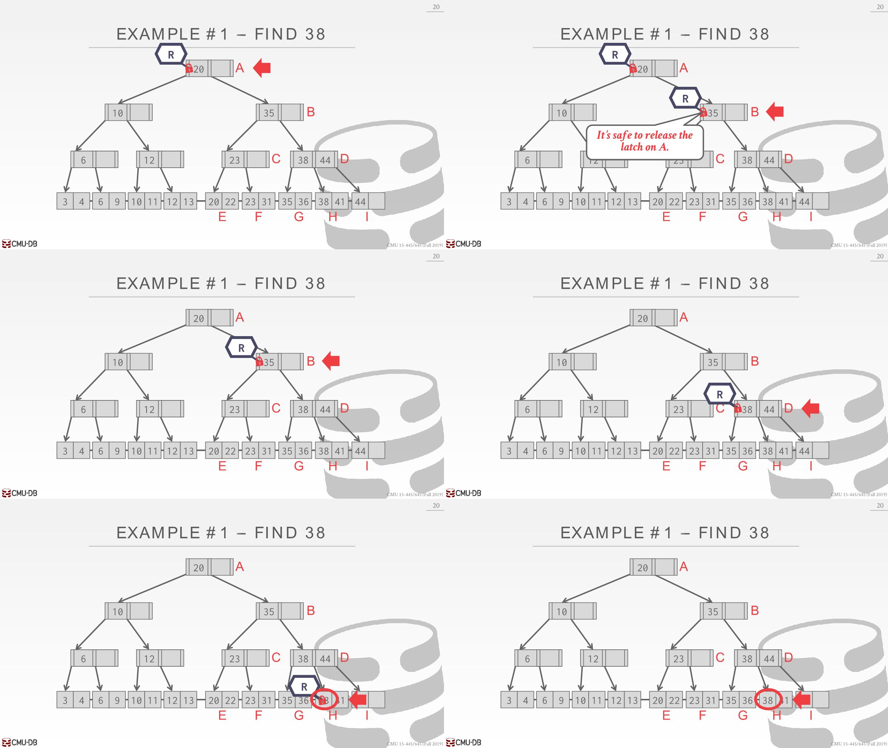
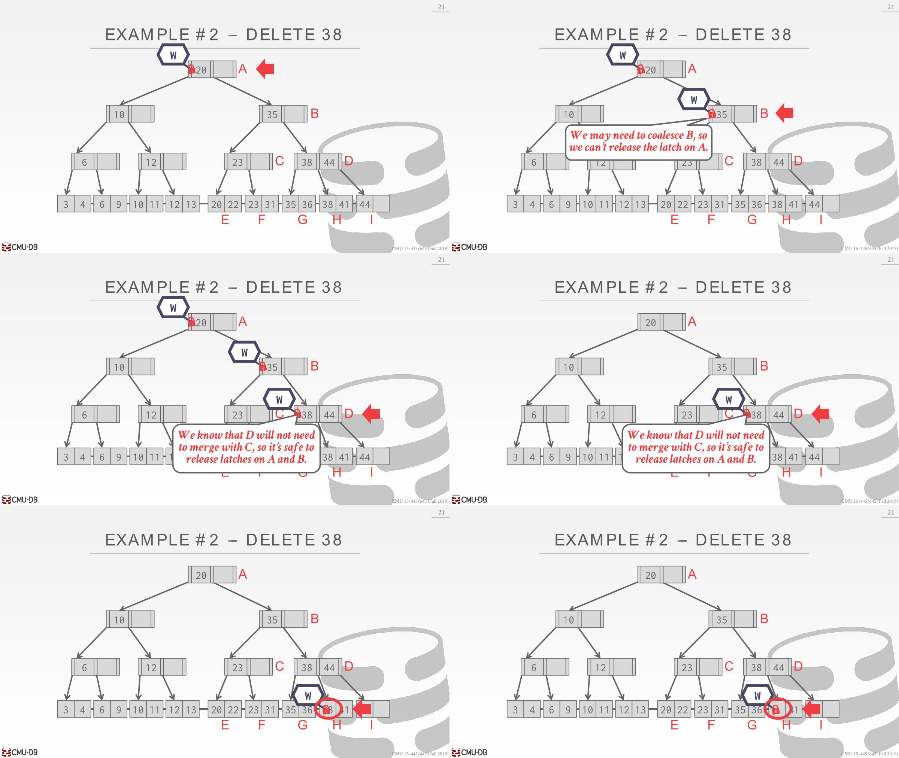
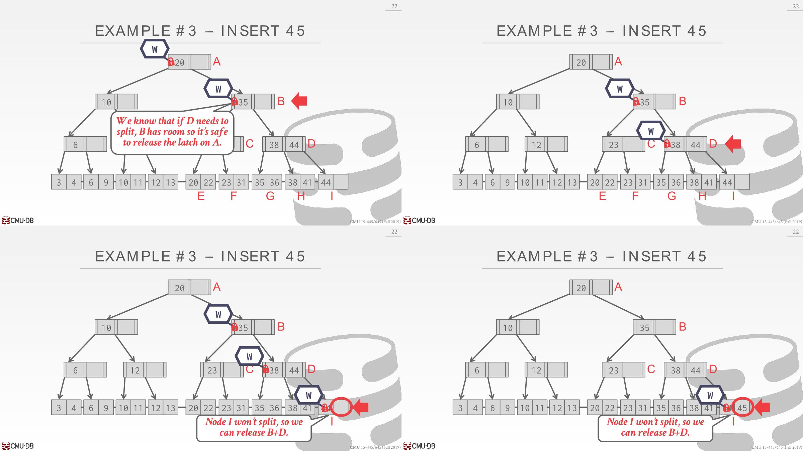
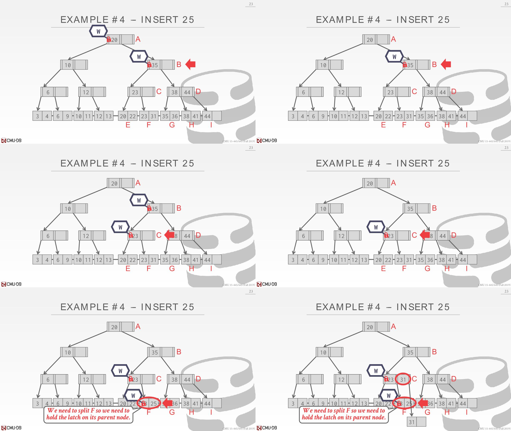

# Latches Overview

- **Locks**
  - Protects  **the indexs logical contents**(tuple, a set of tuple, table, database...) from(*免受xx的影响*) other transactions.
  - Held for (mostly) the entire duration of the transaction.
  - The DBMS needs to be able to rollback changes.
- **Latches**
  - Protects **the critical(*关键*) sections of the indexs internal data structure** from other threads.
  - Held for operation duration. 比如修改一个page，修改时候持有，修改完释放
  - The DBMS does not need to be able to rollback changes. 不需要回滚，可以把每个操作看作有原子性



- lock应对死锁的时候，会依赖一些external coordinator，比如lock manager，transaction manager以此来解决可能发生的死锁问题
- Latch需要依靠程序员写出高质量的代码保证数据结构避免死锁的情况，没法通过外部的东西来解决死锁

## Latch Modes

- Read Mode
  - Multiple threads can read the same object  at the same time.
  - A thread can acquire the read latch if  another thread has it in read mode.
- Write Mode
  - Only one thread can access the object.
  - A thread cannot acquire a write latch if  another thread holds the latch in any  mode.

## Latch Implementations

### Blocking OS Mutex

- Use the OS built-in mutex infrastructure(*基础措施*) as a latch. 

- 使用Futex(fast userspace mutex)实现。在address space of process中会占用一点内存空间(1 bit或者1 byte左右)，通过CAS尝试获取userspace latch。如果没有获取到，就会退一步到OS层面并使用速度更慢的mutex。如果此时还不能获取到，线程就会通知OS此时它被阻塞住，OS将其放到等待队列，等待调度器调度。

- OS mutex is generally a bad idea inside of DBMSs as it is managed by OS and has large overhead.

Example：

```c++
std::mutex m;
m.lock();
...
m.unlock();
```

- Advantages: Simple to use and requires no additional coding in DBMS.

- Disadvantages: Expensive and non-scalable (about 25 ns per lock/unlock invocation) because of OS scheduling.

### Test-and-Set Spin Latch (TAS)

- Spin(*自旋*) latches are a more efficient alternative(*选择*) to an OS mutex as it is controlled by the DBMSs.

- A spin latch is essentially(*本质上*) **a location in memory** that threads try to update (e.g., setting a boolean value to true).  A thread performs **CAS** to attempt to update the memory location. If it cannot, then it spins in a while loop forever trying to update it.

Example：

```c++
std::atomic<bool> latch;
while (latch.test_and_set(...)){
    // Retry?Yield?Abort?
}
```

- Advantages: Latch/unlatch operations are efficient (single instruction to lock/unlock).
- Disadvantages: 
  - Not scalable nor cache friendly because with multiple threads, the CAS instructions will be executed multiple times in different threads. These wasted(*浪费的*) instructions will pile up(*堆积*) in high contention environments; the threads look busy to the OS even though they are not doing useful work. 
  - This leads to(*导致*) cache coherence(*一致性*) problems because threads are polling(*轮询*) cache lines on other CPUs.

### Reader-Writer Latches

Mutexes and Spin Latches **do not differentiate between reads / writes** (i.e., they do not support different modes). We need a way to allow for **concurrent reads**, so if the application has heavy reads(*大量读取*) it will have better performance because readers can share resources instead of waiting.

A Reader-Writer Latch allows a latch to be held in either read or write mode. It keeps track of **how many threads hold the latch** and are waiting to acquire the latch in each mode.

This is implemented on top of Spin Latches. The DBMS has to manage read/write queues to avoid starvation(*饥饿*). Larger storage overhead than Spin Latches due to additional meta-data. 比如一直有读请求过来，如果策略是先处理完读请求，那么写请求一直被阻塞住。



# Hash Table Latching

## Page Latches

- Each page has its own Reader-Writer latch that protects its entire contents. 
- Threads acquire either a read or write latch before they access a page.
- This decreases parallelism because potentially only one thread can access a page at a time. （会有多个线程访问不同的slot的情况，不同的slot可能在同一个page，锁住一个page锁住了多个slot）
  - but accessing multiple slots in a page will be fast because a thread only has to acquire a single latch. （一次性访问多个slot的情况会快很多，只需要获取一把锁即可）

two slots per page，在page header就可以知道有哪些key和其位置在哪里。read latch不能升级为write latch，只能释放掉重新获取。



1. Find D hash(D)指到page2，拿到read latch

2. Insert E hash(E)指到page2，但是已经有read latch了，想要获取write latch得等待

3. page2找不到D，释放read latch，获取page3的read latch，再次查找。Insert E可以获取到了write latch
4. D读完释放read latch。E在page2找不到空闲位置，获取write slot插到page3

## Slot Latches

- Each slot has its own latch. 
- This increases parallelism because two threads can access different slots in the same page. 
- All threads move in the **same direction** when moving from slot to the next (i.e., top-down). 
  - Threads also only access a single page/slot at a time. 
  - Thus, deadlocks are not possible in this situation(*情况*) because no two threads could be competing for latches held by the other. （形成环才能死锁，但是没有向上方向申请锁，所以不会出现环）
  - To resize the table, take a global latch on the entire table (i.e., in the header page).
- But it increases the storage and computational(*计算的*) overhead of accessing the table because threads have to acquire a latch for every slot they access. The DBMS can use a single mode latch (i.e., Spin Latch) to reduce meta-data and computational overhead.



# B+Tree Latching

- We want to allow multiple threads to read and  update a B+Tree at the same time.

- We need to protect from two types of problems:
  - Threads trying to modify the contents of a node at the same time.
  - One thread traversing the tree while another thread  splits/merges nodes. （叶子节点的位置可能会发生变化，甚至之前的已经得到的某个指针可能会指向无效区域）



1. Delete 44，删除后应该要再平衡，这里再平衡采取的措施是将兄弟节点的值移动过去，而不是合并。但是此时OS调度到另外一个线程执行。
2. Find 41，遍历树执行到D位置时候，系统调度刚才那个线程执行再平衡操作，把41从H区域移动到I区域
3. 此时调度到Find 41那个线程，41继续遍历，发现H区域没有41，造成了一个没有41的假象。如果是合并的话，甚至下一步要找的内存区域都不存在，引发程序错误。

## Lock crabbing/coupling

- Lock crabbing / coupling is a protocol to allow multiple threads to access/modify B+Tree at the same time

- Basic Idea
  - Get latch for parent.
  -  Get latch for child.
  - Release latch for parent if `safe`. A safe node is one that will not split or merge when updated (not full on insertion or more than half full on deletion).

## Find

**Find**: Start at root and go down, repeatedly acquire **read latch** on child and then unlatch parent.


## Insert/Delete

**Insert/Delete**: Start at root and go down, obtaining **write latches** as needed. Once child is latched, check if it is safe. If the child is safe, release latches on all its ancestors(*祖先*).






