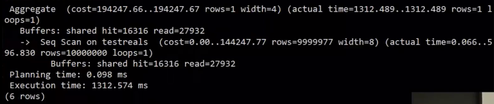

# Buffer Pools

How the DBMS manages its memory and move data back-and-forth from disk.

- Spatial Control
  - Where to write pages on disk
  - 目标：使经常一起使用的page在磁盘上尽可能物理靠近。
- Temporal Control
  - When to read pages into memory, and when to write them to disk.
  - The goal is minimize the number of stalls(*停顿*) from having to  read data from disk.

## Buffer Pool Organization

### Meta Data

Meta-data maintained by the buffer pool:

#### Page Table

In-memory **hash table** that keeps track of pages that are currently in memory. It maps **page ids** to **frame locations** in the buffer pool.

Pin page3 & Latch Page2

`Page Table` vs `Page Directory`:

- The `page directory` is the mapping from page ids to page locations in the database files.
  - All changes must be recorded on disk to allow the DBMS to find on restart.
- The `page table` is the mapping from page ids to a  copy of the page in buffer pool frames.
  - This is an in-memory data structure that does not need to be stored on disk.

#### Dirty Flag

Threads set this flag when it modifies a page. This indicates to storage manager that the page must be written back to disk.

#### Pin Counter

- This tracks the number of threads that are currently accessing that page (either reading or modifying it). A thread has to increment the counter before they access the page.
- If a page’s count is greater than zero, then the storage manager is not allowed to evict(*驱逐*) that page from memory.

### Optimizations

#### Multiple Buffer Pools

- The DBMS does not always have a single buffer  pool for the entire system.
  - Multiple buffer pool instances
  - Per-database buffer pool(*每个数据库一个*)
  - Per-page type buffer pool
- Helps reduce latch contention and improve locality(局部优化策略).

- 如何根据record id定位到buffer pool
  - `Object Id`: 扩展record id，添加object id，维护id到buffer pool的映射。
  _22.JPG)
  - `Hashing`: 对record id进行hash，通过Hash(x)确定在pool中的哪个位置，通过`Hash(x)%n`(num buffer pool)确定在哪个buffer pool。
  _23.JPG)

#### Pre-Fetching

The DBMS can also prefetch pages based on a query plan.

即减少从磁盘读取产生的停顿，额外加载多一点数据到内存。mmap本身就支持prefetch功能，但是只在Sequential Scans的情况下才生效，因为读取是顺序的，正好操作系统也把要读的下一page提前加载到了内存。

如下，读取到page1的时候，page1没有在内存，把page1加载到内存的时候，顺便把page2，3也加载进内存

但是遇到Index Scans就不生效了，因为读取可能是跳跃的。index-page: 0->1->3->5。所以得数据库系统自己处理内存那一块，并不能直接完全用系统的虚拟内存。

#### Scan Sharing

复用某个查询从磁盘中读取到的数据，将该数据用于其他查询。和result caching不一样，后者指是将查询结果缓存起来，遇到一模一样的查询的话直接返回缓存的结果。

If a query wants to scan a table and another query is already doing this, then the DBMS will attach  the second query's cursor(want to do) to the existing cursor(already doing).当前一个查询拿到page的时候，它就通知第二个查询，然后第二个就可以访问它了，类似于发布订阅机制。

1. Q1正常加载page到buffer pool
2. 读取到page3，buffer pool满了，需要剔除一个page
3. 此时Q2也想对这个表扫描，在没有scan sharing的情况下，Q2会和Q1一样从page0开始扫描到最后一个。在有scan sharing的情况下，Q2会跳到Q1的位置，和Q1一样读取相同的数据。
4. Q1结束查询
5. 关系模型是无序的，Q2可以从任意位置开始读取剩下的page，这里是page0
6. 一直读取到page2，完成整个表的读取。

#### Buffer Pool Bypass

避免去page table中进行查询进而因为latch竞争带来额外的开销，从磁盘中拿到的page放到分配的一小块local memory中，而不是buffer pool，当查询完成时，所有这些page就会被丢弃。

使用的这个优化方法的条件是操作的是中间结果和扫描的数据量不是很大，能够暂存于local memory。

### OS Page Cache

- Most disk operations go through the OS API.
  - Unless you tell it not to, the OS maintains its own filesystem cache. 比如使用fread读取文件，如果有cache，则直接返回cache。fwrite时候是写入到page cache，使用sync才写入到disk。
  - Most DBMSs use `direct I/O` (O_DIRECT)to bypass the OS's cache.
    - 减少page副本的数量以避免浪费和数据不同步
    - DBMS能够更好的处理这部分

#### PgSQL Demo

在主流数据库中利用os page cache的只有PostgreSQL，从工程师的角度来看，无需再管理一个额外的缓存（也有自己的buffer pool，不过没有那么大，不会像MySQL/Oracle那样去使用系统中所有的内存），实际上这样可以减少维护的成本。

测试PostgreSQL buffer实际使用情况，假设表testreals只有ab两列，1000w行，每列都是浮点数(例如12.432564635)。

测试前flush cache并重启数据库、开启耗时显示、关闭并行执行:

- `sync; echo 3 > /proc/sys/vm/drop_caches`: force the operating system to flush the file system  page cache.
- `\timing`
- `SET max_parallel_workers_per_gather=0`

测试语句: `EXPLAIN (ANALYZE, BUFFERS) SELECT sum(a+b) FROM testreals`。

---

第一次执行，因为刚将数据库重启，buffer pool也清空了，所以需要从disk中读取所有的page。

如果再执行一次，hit会变为32，即有32个page放到buffer pool，剩下的还在disk。因为PostgreSQL维护了一个小buffer pool，每个查询会有一个小buffer pool，它里面有32个page。

如果再执行一次则变为64，随着一遍又一遍执行这个查询，buffer pool里的page数量也在变大，因为它意识到所需要数据不在buffer pool。

执行`SELECT pg_prewarm('testreals');`扩展程序pg_prewarm将该表所有的page放入buffer pool

再次执行查询，显示已经有1w多个page在buffer pool中了，`16316*8/1024=128MB`，正好达到了数据库设定的上限，加载所有的page需要`44248*8、1024=345MB`。

在`/etc/postgresql/10/main/postgresql.conf`中修改buffer pool上限为360MB：`shared_buffers = 360MB`。然后重新执行下测试前的几个步骤并主席pg_prewarm加载所有page到buffer pool。执行一次查询，现在有足够的内存存放page了。此处查询无需从disk中加载数据，而是从page table中查找frame。

