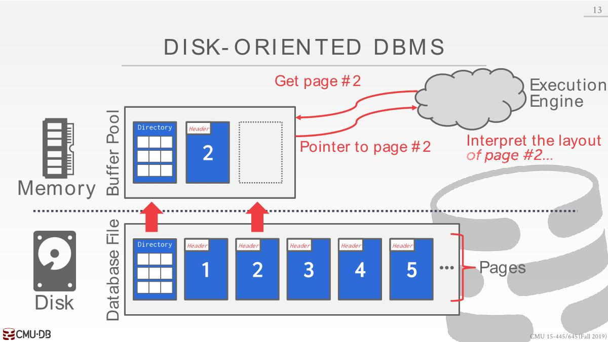
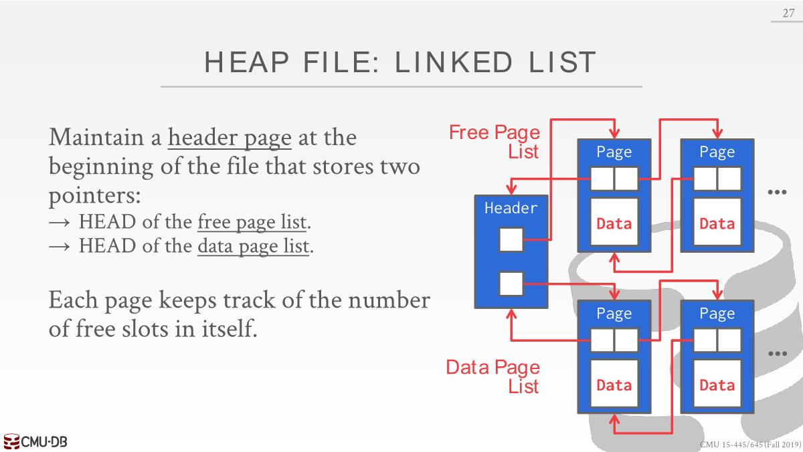

# Database-Storage1

## Disk-Oriented DBMS

- The database is all on **disk**, and the data in the database files is organized into **pages**.

- In order to operate on the data the DBMS needs to bring the data into memory. It does this by having a **buffer pool** that manages the movement back and forth between disk and memory.

- The DBMS also have an **execution engine** that will execute queries.

- The execution engine will ask the buffer pool for a **specific page**, and the buffer pool will take care of(*负责*) bringing that page into memory and giving the execution engine a pointer to the page in memory.

- The buffer pool manager will ensure that the page is there while the execution engine is operating on that memory.

## why not use the os

- A high-level design goal of the DBMS is to support databases that exceed(*超过*) the amount of memory available.

- We want the DBMS to be able to process other queries while it is waiting to **get the data from disk**.

- It's like virtual memory. One way to achieve this virtual memory, is by using **mmap** to map the contents of a file in a process address space, which makes the OS responsible for moving pages back and forth between disk and memory.

- If mmap hits a page fault, this will block the process.

- DBMS (almost) always wants to control things itself and **can do a better job at it**.
  - Flushing dirty pages to disk in the correct order
  - Specialized prefetching(*预读数据*)
  - Buffer replacement policy(*策略*)
  - Thread/process scheduling

总的来说，mmap可能会导致性能瓶颈，并且我们需要处理额外的问题。对于DB来讲，我们知道应该将哪个page写入到磁盘或者是加载到内存由此达到最好的调度和性能，但是操作系统对此一概不知，尽管可以利用一些系统提供的函数保证在某个时刻处理我们想要的page。

## File Storage

How the DBMS represents the  database in files on disk.

- In its most basic form(*最基本的形式*), a DBMS stores a database as **one or more file on disk**.
  - Some may use a **file hierarchy,** others may use a single file (e.g., SQLite).
  - The OS does not know anything about the contents of these files.
  - Only the DBMS knows how to decipher(*解密*) their contents, since it is encoded in a way specific to the DBMS.
- Early systems in the 1980s used **custom filesystems** on raw storage.
  - Some "enterprise" DBMSs still support this. e.g., Oracle,DB2,SQL sevrer.
  - Most newer DBMSs do not do this. 可移植性低，比不上EXT4之类的通用文件系统。
- The DBMS’s **storage manager/engine** is responsible for **managing a database’s files**.
  - It represents the files as a **collection of pages**.
  - It also keeps **track** of what data has been read and written to pages, as well how much **free space** there is in the pages.

## Database pages

- A page is a fixed-size block of data
  - It can contain different kinds of data (tuples, meta-data, indexes, log records...)
  - Some systems require a page to be **self-contained**, meaning that all the information needed to read each page is on the page itself. e.g., table metadata.
  - Most systems do not mix page types. 比如一个page中只保存tuple或者是index。
- Each page is given a unique identifier
  - The DBMS uses an **indirection layer** to map page ids to  physical locations. 主要原因是在内部能够移动page，对磁盘压缩或者更换磁盘时候能够根据id确定物理位置。
- There are three concepts of pages in DBMS
  - Hardware Page (usually 4KB)
  - OS Page (usually 4KB)
  - Database Page (512B~16KB)
- The storage device guarantees an **atomic write** of the size of the **hardware page**.

## Page storage architecture

- Different DBMSs manage pages in files on disk in  different ways.
  - **Heap File Organization**
  - Sequential / Sorted File Organization
  - Hashing File Organization
- At this point in the hierarchy we don't need to  know anything about what is inside of the pages.

## Database Heap

- A heap file is an **unordered collection of pages** where tuples are stored in **random order**.

- Need meta-data to keep track of what pages exist  and which ones have free space.

- Two ways to represent a heap file：`Linked List`、`Page Directory`

### Linked List

- Maintain a **header page** at the beginning of the file that stores two pointers:
  - HEAD of the **free page** list.
  - HEAD of the **data page** list.
- Each page keeps track of the number of free slots in itself.  
- 可能需要反向查询，所以需要双向链表
- 因为没有元数据，需要插入的时候，得遍历每一个free page，查看它是否有足够的剩余空间存储数据。

### Page Directory

