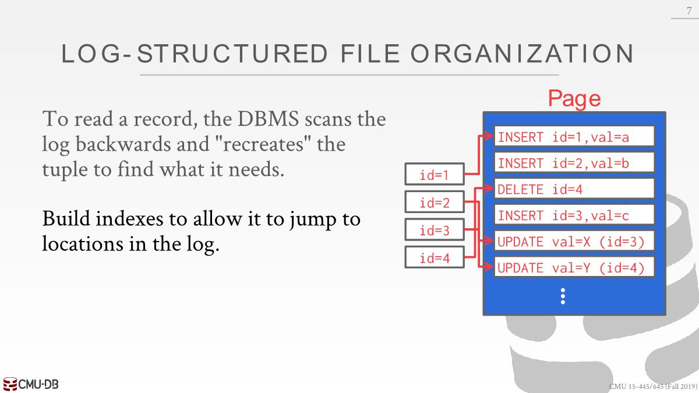

# Database-Storage1

## Disk-Oriented DBMS

- The database is all on **disk**, and the data in the database files is organized into **pages**.

- In order to operate on the data the DBMS needs to bring the data into memory. It does this by having a **buffer pool** that manages the movement back and forth between disk and memory.

- The DBMS also have an **execution engine** that will execute queries.

- The execution engine will ask the buffer pool for a **specific page**, and the buffer pool will take care of(*负责*) bringing that page into memory and giving the execution engine a pointer to the page in memory.

- The buffer pool manager will ensure that the page is there while the execution engine is operating on that memory.


## why not use the os

- A high-level design goal of the DBMS is to support databases that exceed(*超过*) the amount of memory available.

- We want the DBMS to be able to process other queries while it is waiting to **get the data from disk**.

- It's like virtual memory. One way to achieve this virtual memory, is by using **mmap** to map the contents of a file in a process address space, which makes the OS responsible for moving pages back and forth between disk and memory.

- If mmap hits a page fault, this will block the process.

- DBMS (almost) always wants to control things itself and **can do a better job at it**.
  - Flushing dirty pages to disk in the correct order
  - Specialized prefetching(*预读数据*)
  - Buffer replacement policy(*策略*)
  - Thread/process scheduling

总的来说，mmap可能会导致性能瓶颈，并且我们需要处理额外的问题。对于DB来讲，我们知道应该将哪个page写入到磁盘或者是加载到内存由此达到最好的调度和性能，但是操作系统对此一概不知，尽管可以利用一些系统提供的函数保证在某个时刻处理我们想要的page。

## File Storage

How the DBMS represents the  database in files on disk.

- In its most basic form(*最基本的形式*), a DBMS stores a database as **one or more file on disk**.
  - Some may use a **file hierarchy,** others may use a single file (e.g., SQLite).
  - The OS does not know anything about the contents of these files.
  - Only the DBMS knows how to decipher(*解密*) their contents, since it is encoded in a way specific to the DBMS.
- Early systems in the 1980s used **custom filesystems** on raw storage.
  - Some "enterprise" DBMSs still support this. e.g., Oracle,DB2,SQL sevrer.
  - Most newer DBMSs do not do this. 可移植性低，比不上EXT4之类的通用文件系统。
- The DBMS’s **storage manager/engine** is responsible for **managing a database’s files**.
  - It represents the files as a **collection of pages**.
  - It also keeps **track** of what data has been read and written to pages, as well how much **free space** there is in the pages.

## Database pages

- A page is a fixed-size block of data
  - It can contain different kinds of data (tuples, meta-data, indexes, log records...)
  - Some systems require a page to be **self-contained**, meaning that all the information needed to read each page is on the page itself. e.g., table metadata.
  - Most systems do not mix page types. 比如一个page中只保存tuple或者是index。
- Each page is given a unique identifier
  - The DBMS uses an **indirection layer** to map page ids to  physical locations. 主要原因是在内部能够移动page，对磁盘压缩或者更换磁盘时候能够根据id确定物理位置。
- There are three concepts of pages in DBMS
  - Hardware Page (usually 4KB)
  - OS Page (usually 4KB)
  - Database Page (512B~16KB)
- The storage device guarantees an **atomic write** of the size of the **hardware page**.

## Page storage architecture

- Different DBMSs manage pages in files on disk in  different ways.
  - **Heap File Organization**
  - Sequential / Sorted File Organization
  - Hashing File Organization
- At this point in the hierarchy we don't need to  know anything about what is inside of the pages.

## Database Heap

- A heap file is an **unordered collection of pages** where tuples are stored in **random order**.

- Need meta-data to keep track of what pages exist  and which ones have free space.

- Two ways to represent a heap file：`Linked List`、`Page Directory`

### Linked List


- Maintain a **header page** at the beginning of the file that stores two pointers:
  - HEAD of the **free page** list.
  - HEAD of the **data page** list.
- Each page keeps track of the number of free slots in itself.  
- 可能需要反向查询，所以需要双向链表
- 因为没有元数据，需要插入的时候，得遍历每一个free page，查看它是否有足够的剩余空间存储数据。

### Page Directory


DBMS maintains special pages that track **locations of data pages** along with(*以及*) the mount of **free space on each page**.

如果数据库用的page比较大，那么page directory记录的个数就会变少，查找就会变快，并且类似于缓存一样，出现cache miss的次数就会变少(承载的数据变多了)，但是写入代价就会变大，需要硬件只保证小page的原子性。

## Page Layout

- Every page includes a **header** that records meta-data about the page’s contents
  - Page size
  - Checksum
  - DBMS version: 不同版本的layout可能不一样
  - Transaction visibility
  - Compression Information
  - Some systems require pages to be self-contained (e.g oracle)

- How to organize the data stored inside of the page: Tuple-oriented / Log-structured

### Tuple-oriented

#### strawman idea


Strawman(*稻草人*) Idea: 统计Num Tuples，就可以知道下一个tuple插到哪个位置。但是删除中间的tuple的时候，只能将被删除点之后的tuple往上移动，或者是释放掉被删除点，然后插入新的数据，但是释放后的空间可能存不下新数据。

#### slotted pages


- tuple由page id和slot number确定的
- The page is considered full when the slot array and the tuple data meet.
  
- 有时候剩下部分空间太小不足以存储数据，我们可以进行vaccum(postgresql中的一个操作，用于整理数据库)或者compaction。
- 一般一个page只放一个表的tuple以及尽量将整个tuple放在一个page。

#### Record ids

- Each tuple is assigned a unique **record identifier**. 一般用`page_id + offset/slot number`表示。

- 好处是不管移动page还是page内移动数据，只要更新page directory和slot array即可，上层依旧可以用page_id和slot number去定位tuple的位置。

在PostgreSQL中用`ctid`表示某一个tuple的物理位置，输出格式为`(page_id, slot number)`

```sql
SELECT ctid, * FROM enrolled
```

|ctid|sid|cid|grade|
|:----|:----|:----|:----|
|(0,1)|53666|15-445|C|
|(0,2)|53688|15-721|A|
|(0,3)|53688|15-826|B|

第一个tuple放在page 0的slot 1处，实际上并没有保存这个数据，在执行查询的时候产生的。

删除掉第二个数据后
|ctid|sid|cid|grade|
|:----|:----|:----|:----|
|(0,1)|53666|15-445|C|
|(0,3)|53688|15-826|B|

插入一条新数据

|ctid|sid|cid|grade|
|:----|:----|:----|:----|
|(0,1)|53666|15-445|C|
|(0,3)|53688|15-826|B|
|(0,4)|53655|15-445|B|

在PostgreSQL中会将数据插在后面，放着空slot不管。SQL server则会在插入之前先整理page，比如`(0,0),(0,2)`插入一条数据会变成`(0,0),(0,1),(0,2)`，`(0,3)`为新插入的数据

使用vacuum可以整理page

```sql
VACUUM FULL;
```

|ctid|sid|cid|grade|
|:----|:----|:----|:----|
|(0,1)|53666|15-445|C|
|(0,2)|53688|15-826|B|
|(0,3)|53655|15-445|B|

### Log-structured


- 方便回滚（比如1000行只修改了一行只需要删除这条修改记录），写入快（有一个更新语句需要更新10个page，但是一条日志只需要写一个page就行，disk顺序访问也比随机访问快）
- 读取慢，需要在日志中查找对应的tuple并计算结果。但是可以建立索引直接跳转到特定位置，并且定期压缩日志变成只插入日志以提高速度。
  
  

## Tuple Layout

- A tuple is essentially(*本质上*) **a sequence of bytes**. It is DBMS’s job to interpret those bytes into **attribute types and values**.

- The DBMS's catalogs contain the schema information about tables that the system uses to figure out the tuple's layout.

### Tuple Header

- Each tuple is prefixed with a **header** that contains meta-data about it.
  - **Visibility information** for the DBMS’s concurrency control protocol (i.e., information about which
transaction created/modified that tuple).
  - Bit Map for **NULL** values.
  

### Tuple Data

- Tuple Data: Actual data for attributes.

- Most DBMSs do not allow a tuple to exceed(*超过*) the size of a page.


### Denormalized(*非规范化*) Tuple Data

If two tables are related, the DBMS can “pre-join” them, so the tables end up
on the **same page**.

This makes **reads faster** since the DBMS only has to load in one page rather than two separate pages, but it makes **updates more expensive** since the DBMS needs more space for each tuple.

应用程序看来是两张表，但是实际上是存在同一个page中。


现实中一般不会这样做，按照规范，将数据拆分到不同的表就好。
