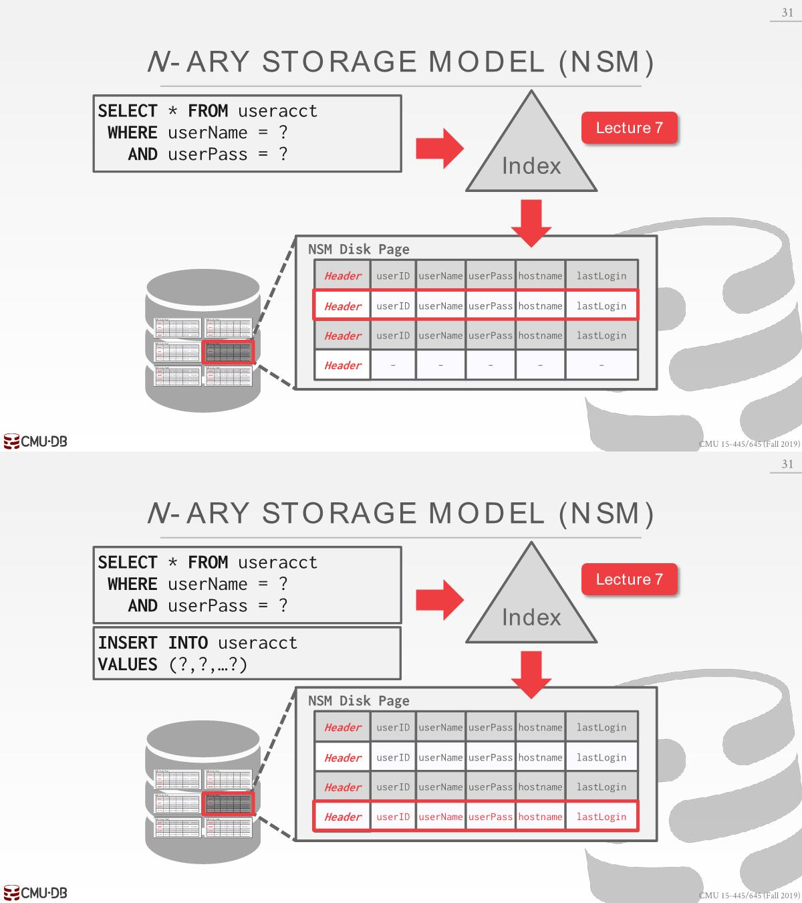

# Database-Storage2

## Data Representation

A **data representation** scheme is how a DBMS stores the bytes for a value.

### Integers

- Most DBMSs store integers using their “native” C/C++ types as specified by the IEEE-754 standard.These values are fixed length.
- Examples: `INTEGER`, `BIGINT`, `SMALLINT`, `TINYINT`.

### Variable Precision(*精度*) Numbers

- Inexact(*不精确*), variable-precision(*可变精度*) numeric type that uses the “native” C/C++ types specified by IEEE-754 standard. These values are also fixed length.
- Variable-precision numbers are faster to compute than arbitrary precision(*任意精度*) numbers because the CPU can execute instructions on them directly.
- Examples: `FLOAT`, `REAL`(*实数*).

### Fixed Point Precision Numbers

- 这些是具有任意精度和小数位数的数值数据类型。它们通常存储在精确的、可变长度的二进制表示中，并带有附加的元数据，这些元数据将告诉系统小数应该在哪里等信息。
- 当舍入误差不可接受时使用这些数据类型，但 DBMS 为获得这种准确性付出了性能损失。
- Example: `NUMERIC`, `DECIMAL`.

### Variable Length Data

- An array of bytes of arbitrary length.
- Has a header that keeps track of the length of the string to make it easy to jump to the next value.
- 大多数 DBMS 不允许tuple超过单个page的大小，因此它们通过将值写入overflow(*溢出*) page并让tuple包含对该page的引用来解决此问题。如果一个overflow page不够则再指向另外一个。
  

- Some systems will let you store these large values in an external file, and then the tuple will contain a pointer to that file.
  - For example, if our database is storing photo information, we can store the photos in the external files rather than having them take up large amounts of space in the DBMS.
  - One downside(*缺点*) of this is that the DBMS cannot manipulate(*操作*) the contents of this file.
    
- Example: `VARCHAR`, `VARBINARY`, `TEXT`, `BLOB`.

### Dates and Times

- Usually, these are represented as the number of (micro/milli)seconds since the unix epoch(从1970-01-01开始).
- Example: `TIME`, `DATE`, `TIMESTAMP`.

## System catalog

- In order for the DBMS to be able to read these values, it maintains an internal **catalog** to tell it meta-data about the databases. 
  - Tables, columns, indexes, views, users, permissions, internal statistics(多少个唯一值等)
  - 很多数据库系统都会将它们的Catalog用另一张表来保存
- You can query the DBMS’s internal **INFORMATION_SCHEMA** catalog to get info about the database.
  - ANSI standard set of read-only views that provide info about all of the tables, views, columns, and procedures in a database.
  - DBMSs also have non-standard shortcuts to retrieve(*检索*) this information.
  
  

## Workloads

HTAP: hyper transaction analytical processing，比如查询分析推荐

- 对于传统的NoSQL数据库MongoDB、Cassandra、Redis属于OLTP那块。在某些分析方面，MongoDB也做了一些支持，但是比不上列存储数据库。

- MySQL、PostgreSQL支持一些属于OLAP的查询，但也比不上列存储数据库

- 谷歌推出了NoSQL数据库HBase(OLTP)、BigTable(OLTP)、Hadoop(OLAP)，不支持SQL、事务处理、Join操作。

- NewSQL：为OLTP提供NoSQL的特性，但是又支持传统事务的ACID保证。

## Data Storage Models

The DBMS can store tuples in different ways that  are better for either OLTP or OLAP workloads.

Row stores are usually better for OLTP, while column stores ar better for OLAP.

### n-ary storage model(NSM)

- The DBMS stores all of the attributes for a single tuple contiguously, so NSM is also known as a “row store.”

- Ideal for(*适合*) OLTP workloads where transactions tend to(*倾向*) operate only an individual entity and insert heavy workloads. 

查询根据索引给出的page_id和slot number定位到tuple，插入时候数据连续放在一起。

统计每个月的主机名以.gov结尾的用户登录数量，我们要对整个用户账号表进行循序扫描，根据他们的hostname，以此来找到所有的.gov结尾的账号。

磁盘读取是以page为单位，没办法直接拿到hostname和lastLogin那列，为了读取两列，需要将整个page放到内存(buffer pool)中，而大部分列是没有用到的。

- Advantages
  - Fast inserts, updates, and deletes.
  - Good for queries that need the entire tuple.
- Disadvantages
  - Not good for scanning large portions of the table and/or a subset of the attributes.

### Decompositio(*分散*) Storage Model (DSM)

- The DBMS stores a single attribute (column) for all tuples contiguously in a block of data. Also known as a “column store.”

- Ideal for OLAP workloads where read-only queries perform large scans over a subset of the table’s attributes.

- To put the tuples back together(*重新组合*) when we are using a column store, we can use:

  - **Fixed-length Offsets(most commonly)**
    - Each value is the same length for an attribute.  
    - Then when the system wants the attribute for a specific tuple, it knows how to jump to that spot in the file. 对于可变的数据，可以压缩或者填充变为同样大小的。
  - Embedded Tuple Ids
    - Each value is stored with its tuple id in a column.
    - The system would also need extra information to tell it how to jump to every attribute that has that id.

- Advantages
  - Reduces the amount of wasted work during query execution because the DBMS only reads the data that it needs for that query.
  - Enables better compression because all of the values for the same attribute are stored contiguously.
- Disadvantages
  - Slow for point queries, inserts, updates, and deletes because of tuple splitting/stitching.