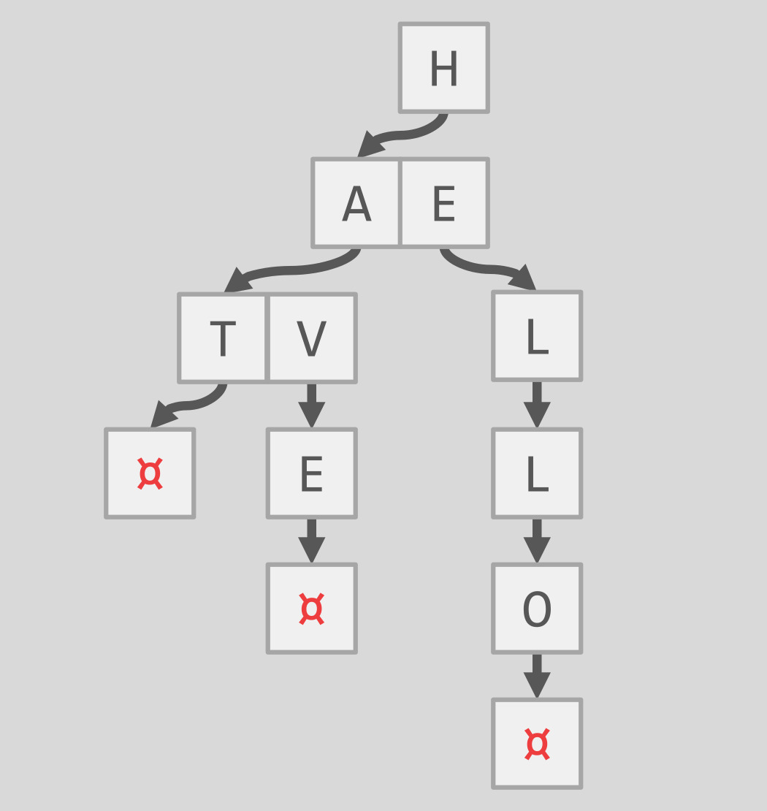
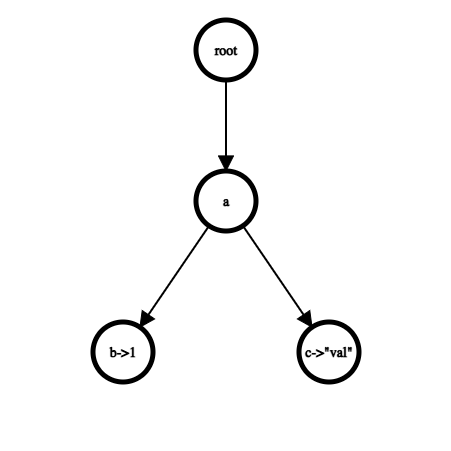
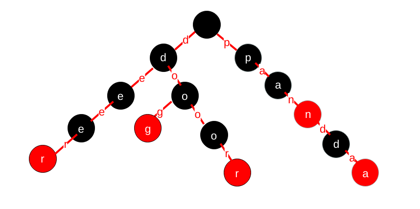

# 背景

- 链接：https://15445.courses.cs.cmu.edu/fall2022/project0/
- 目的：因为后续的项目都是使用c++编写，所以提供一个入门c++项目给新手熟悉下。
- 要求：给出基本的代码框架，填充核心代码实现trie树的插入、查找、删除。最终要求为并发版本，但是不要求性能，所以可以一把大锁直接梭哈。
- 环境：使用clang-12，c++17标准
- 使用到的常见cpp知识点：
  - unique_ptr管理内存资源
  - 类的常见知识，比如构造函数，类方法等
  - rvalue与move
  - shared_mutex


# trie树

简单记录下trie树

## 作用

又称**前缀树**或**字典树**，存储公共前缀字符串比较高效，一般用于字符串查找。

在项目中的应用是将(key, value)插入到trie树，类似hashmap的作用，但是使用trie树实现。

普通的trie树如下：



项目中要求实现的trie树：



上面是将(ab, 1)和(ac, "val")插入到trie。注意项目中的value都是同类型的，这里是不同类型

## 结构

给出的代码框架中总共有三个类

- `TrieNode`：除了带有value的节点外，树的每个节点都是这种类型。这种类型的节点的EndNode值自然为false，children_是一个unordered_map，里面记录了其子节点的信息。
- `TrieNodeWithValue`：带有value的节点，继承自TrieNode，多了个T value_属性，EndNode值为true
- `Trie`：trie树的实现，需要实现查找插入删除方法

## 查找

查找比较简单，顺着根节点一直找到末尾，这里比较简单的一种方法直接遍历给定的key，不断更新currentNode到末尾。

最后再使用dynamic_cast在运行时将TrieNode类型转为TrieNodeWithValue类型提取出value。

## 插入

插入的时候需要知道有哪些字符已经在树中了，所以开始需要遍历一下key，看currentNode能到哪里。

接着如果遍历完了整个key，就代表已经树中已经有了完全字符，此时最后一个节点可能有两者情况，可能需要转换节点类型。

否则就将剩余的字符插到树里面。

## 删除

参考：https://cloud.tencent.com/developer/article/1530883、https://www.geeksforgeeks.org/trie-delete/



删除有两个情况：

- 删除door单词，需要把第二个o和r也删除掉
- 删除pan，直接把n那个节点的EndNode属性设置为False就可。

这里的难点就在于怎么从子节点回溯删除父节点，其中一个方法是使用递归，先递归到最后一个节点，如果需要删除父节点，可以返回一个nullptr代表子节点删除了，父节点可能也需要删除，这样就实现了父子节点的逆向联系，具体如下：

```c++
std::unique_ptr<TrieNode> *RecursivelyRemoveNode(const std::string &key, std::unique_ptr<TrieNode> *root,
                                                 size_t depth) {
  // 返回值代表上一个节点有没有被删除
  // 作用是使其父节点将其删除，从达到从底向上遍历的效果

  // root倒数第一个节点
  // 第一次递归时候root获取到第一个字符，但是depth已经为1，指向第二个字符
  // 所有这里要遍历到最后一个字符对应的节点，得是以下条件
  if (depth == key.size()) {
    // 该字符串已经删除了，所以如果最后一个字符对应的节点是end节点，先取消掉
    if (root->get()->IsEndNode()) {
      root->get()->SetEndNode(false);
    }
    // 该节点没有子节点，删除掉
    if (!root->get()->HasChildren()) {
      root->reset();
      root = nullptr;
    }
    return root;
  }

  // 最后一次递归完，root为倒数第二个节点
  auto last_node = RecursivelyRemoveNode(key, root->get()->GetChildNode(key[depth]), depth + 1);
  // 上一个节点被删除掉，对应的其父子节点也得删除掉
  if (last_node == nullptr) {
    root->get()->RemoveChildNode(key[depth]);
  }

  // 向上回溯删除
  if (root->get()->GetKeyChar() != '\0' && !root->get()->HasChildren() && !root->get()->IsEndNode()) {
    root->reset();
    root = nullptr;
  }
  return root;
}
```

# 获取测试用例

参考：https://blog.csdn.net/freedom1523646952/article/details/123056958

原本项目里面带的测试用例都是比较简单的，gradescope里面的测试会稍微复杂一点。

gradescope能够多次提交测试，但是因为可能要排队，所以有时候测试挺久，有一个方法能够拉取测试代码下来，在本地测试。

```c++
#include <fstream>
#include <iostream>
#include <vector>

void GetTestFileContent() {
  static bool first_enter = true;
  if (first_enter) {
    std::vector<std::string> filenames = {
        "/autograder/bustub/test/primer/grading_starter_trie_test.cpp",
    };
    std::ifstream fin;
    for (const std::string &filename : filenames) {
      fin.open(filename, std::ios::in);
      if (!fin.is_open()) {
        std::cout << "cannot open the file:" << filename << std::endl;
        continue;
      }
      char buf[200] = {0};
      std::cout << filename << std::endl;
      while (fin.getline(buf, sizeof(buf))) {
        std::cout << buf << std::endl;
      }
      fin.close();
    }
    first_enter = false;
  }
}
```

将上述的方法放入到要提交的代码文件中，然后在任意一个构造函数中调用，比如

```c++
explicit TrieNode(char key_char) : key_char_{key_char} {GetTestFileContent();}
```

然后压缩并提交代码，在平台的执行日志中就可以看到打印了测试代码，将测试代码复制下来即可。

ps：添加了代码后记得重新format代码，并执行格式测试命令，避免还没有执行到代码就因为格式问题被打回。

# 常见问题

## TrieNode如何转换为TrieNodeWithValue

假设插入如下数据：

```
("abc", 1)
("ab", 2)
```

在插入ab的时候，因为之前插入abc的时候，已经有了a节点和b节点，并且b节点的类型为TrieNode，所以我们的任务其实是将b节点类型转为TrieNodeWithValue，而我们遍历一般以如下的形式：

```c++
std::unique_ptr<TrieNode> *current_node = &root_;
for (char c : key) {
    if (!current_node->get()->HasChild(c)) {
        return false;
    }
    current_node = current_node->get()->GetChildNode(c);
}
```

当这个循环退出的时候，current_node指向的是b节点，问题就是怎么将current_node指向的节点的类型变为TrieNodeWithValue。

```c++
template <typename T>
void ConvertToTrieNodeWithValue(std::unique_ptr<TrieNode> *currentNode, T value) {
    auto new_node = new TrieNodeWithValue<T>(std::move(**currentNode), value);
    currentNode->reset(new_node);
}
```

- currentNode为a节点的一个子节点（unordered_map里面key为a的value），所以这里可以直接将currentNode的值变为TrieNodeWithValue就行，相当于子节点的类型也变了，也就是说之前指的是TrieNode，现在指向TrieNodeWithValue就行，这样就完成了节点转换。
- `*currentNode`表示取到`std::unique_ptr<TrieNode>`，`**currentNode`表示取到`TrieNode`

- 因为TrieNodeWithValue有个构造函数`TrieNodeWithValue(TrieNode &&trieNode, T value)`，所以取`std::move(**currentNode)`使用move constructor避免了不必要的复制操作。

- 在完成转换后，原始的 `TrieNode` 对象已经不再被引用，由于没有显式释放内存，它将自动被销毁。

## defer unlock

go中有一个很好的功能defer，用于在函数退出时执行一些操作，这样可以避免忘记unlock，但是c++中没有，可以使用以下代替。

```c++
#include <iostream>
#include <mutex>
#include <thread>

std::shared_timed_mutex mtx;

void foo() {
    //独占锁,只能被一个线程访问
    std::shared_lock<std::shared_mutex> lock(mtx_);     
    // ...
}

void bar() {
    //共享锁,在一次时刻，多个线程可以同时访问共享锁所保护的资源
    std::unique_lock<std::shared_mutex> lock(mtx_); 
    // ...
}

int main() {
    std::thread t1(foo);
    std::thread t2(bar);

    t1.join();
    t2.join();

    return 0;
}
```

 
