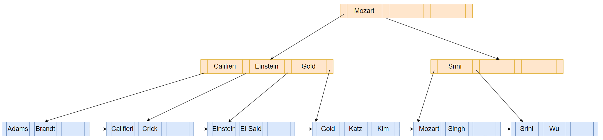
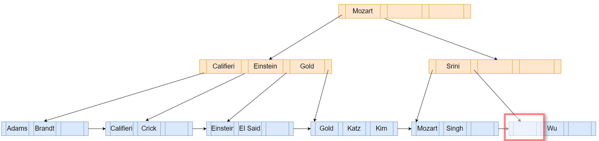
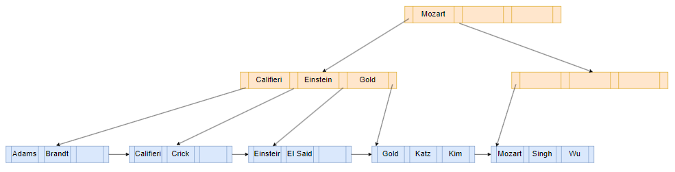
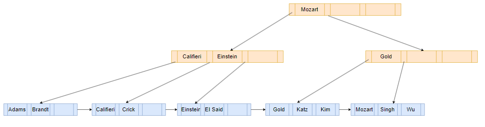

单线程版 B+树删除操作

# Delete

在删除时用到两个重要的属性是，也就是node最多有多少个search-key value，最少有多少个，根据这个可以决定采用什么措施去维持整个树的平衡

- Each **leaf** can hold up to `n−1` search-key values. We allow leaf nodes to contain as few as `⌈(n−1)/2⌉` search-key values.
- Each **nonleaf node** in the tree (other than the root) has between `⌈n/2⌉` and `n` children.

下面举例课本中的删除过程：

已经有一棵B+树如下，从leaf node可知N=4

所以leaf node最多放3个search-key value，最少2个search-key value；nonleaf node最多4个children，最少2个children。

<!--对于nonleaf node来讲是按children计算，对于leaf node是search-key value，单位不一样，但是n还是通用的。因为nonleaf node还要指向下一个节点，其实它的search-key value就是children，因为nonleaf node第一个entry的特殊性，所以这里区分开免得混乱。总的来说，对于nonleaf node讲的是多少个children，这样可以记得还有第一个entry的特殊性，对于leaf node则讲有多少个search-key value，因为其不用指向下一个node，对于连接下一个leaf node的实现，有一个next_page_id_属性-->

## Coalesce

一开始要删除Srini这个Index，首先查找到Srini位于哪个leaf node，然后将其删除，如下图：

删除后这个leaf node只剩下一个key，不符合树的属性，树的key总共有那么多，为了让每个node都符合上述的属性，有两种方法可以来调整，一个是coalesce，另一个则是redistribute。前者意思是合并兄弟节点，后者意思是节点间重新分配。

在这里该leaf node可以和左边的兄弟节点合并，然后删除剩下的空leaf node和指向其的parent：

## Redistribute

此时有一个internal node（第二层最右边）只有一个entry（key没有用到，value指向下一个节点），不符合树的属性，需要调整。

如果采用合并的策略，那么明显左边的node已经有4个children了，加上现有一个，总共5个，超出最大值。

只能是采取兄弟节点间重新分配的策略，以便每个节点至少有2个children

如上图，将左边兄弟节点的Gold search-key移动到右边的节点

---

For more：

- [B+树的删除 - 知乎](https://zhuanlan.zhihu.com/p/375685969)