单线程版 B+树删除操作

# Delete

在删除时用到两个重要的属性是，也就是node最多有多少个search-key value，最少有多少个，根据这个可以决定采用什么措施去维持整个树的平衡

- Each **leaf** can hold up to `n−1` search-key values. We allow leaf nodes to contain as few as `⌈(n−1)/2⌉` search-key values.
- Each **nonleaf node** in the tree (other than the root) has between `⌈n/2⌉` and `n` children.

下面举例课本中的删除过程，粗略了解一下删除的过程：

已经有一棵B+树如下，从leaf node可知N=4

所以leaf node最多放3个search-key value，最少2个search-key value；nonleaf node最多4个children，最少2个children。

<!--对于nonleaf node来讲是按children计算，对于leaf node是search-key value，单位不一样，但是n还是通用的。因为nonleaf node还要指向下一个节点，其实它的search-key value就是children，因为nonleaf node第一个entry的特殊性，所以这里区分开免得混乱。总的来说，对于nonleaf node讲的是多少个children，这样可以记得还有第一个entry的特殊性，对于leaf node则讲有多少个search-key value，因为其不用指向下一个node，对于连接下一个leaf node的实现，有一个next_page_id_属性-->

## Coalesce

一开始要删除Srini这个Index，首先查找到Srini位于哪个leaf node，然后将其删除，如下图：

删除后这个leaf node只剩下一个key，不符合树的属性，树的key总共有那么多，为了让每个node都符合上述的属性，有两种方法可以来调整，一个是coalesce，另一个则是redistribute。前者意思是合并兄弟节点，后者意思是节点间重新分配。

在这里该leaf node可以和左边的兄弟节点合并，然后删除剩下的空leaf node和指向其的parent node

## Redistribute

此时有一个internal node（第二层最右边）只有一个entry（key没有用到，value指向下一个节点），不符合树的属性，需要调整。

如果采用合并的策略，那么明显左边的node已经有4个children了，加上现有一个，总共5个，超出最大值。

只能是采取兄弟节点间重新分配的策略，以便每个nonleaf节点至少有2个children

如上图，将左边兄弟节点的Gold search-key移动到右边的节点，此时右边节点共有两个children。此时root节点并不能区分其两个children，因为Mozart左边children的范围应该是小于"Mozart"，右边children的范围应该是大于等于"Mozart"，右边的children不符合要求。所以需要将root节点"Mozart"和children节点"Gold"进行交换，如下图所示。其实也挺好理解的，原本要移动的值是小于其父节点的，现在需要移动到右边，那么肯定不能直接移动，移动了就不符合大小定义了，所以可以直接移动到父节点，而父节点移动到右边，就能满足了，因为整体从左到右是增大的顺序，这样移动保持了相对位置没有发生改变。

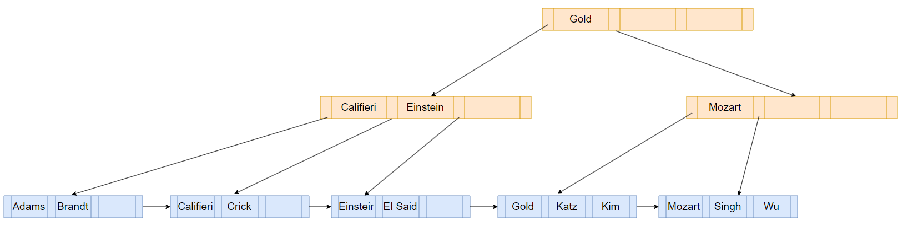

现在接着删除"Singh"和"Wu"，删除"Singh"后还剩下两个search-key value，删除"Wu"后只剩下一个了，该leaf node处于underfull状态。

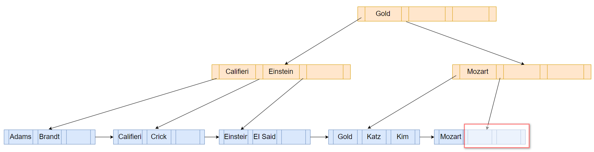

由上图可知不能合并兄弟节点，只能执行重新分配策略，将左边兄弟节点的"Kim"移动到右边

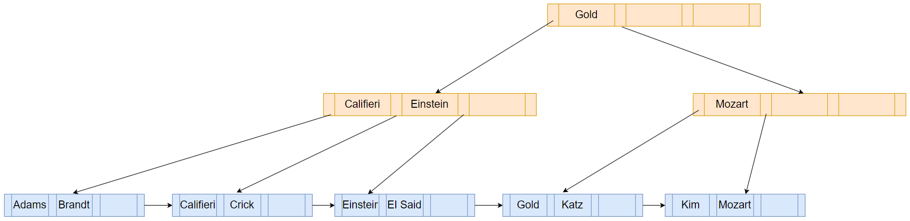

上图中第二层右边的"Mozart"不能区分其children节点，为此需要将其变成"Kim"，如下图：

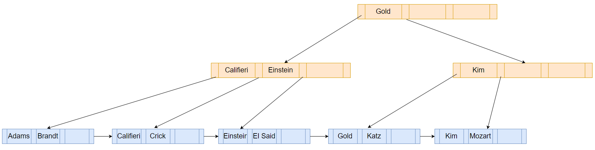

## Underflow

接着删除"Gold"，如下图，该leaf node处于underfull状态

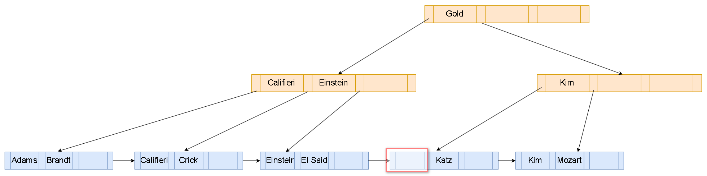

由上图，该leaf node可以和右边的兄弟节点进行合并，同时删除一个parent node：

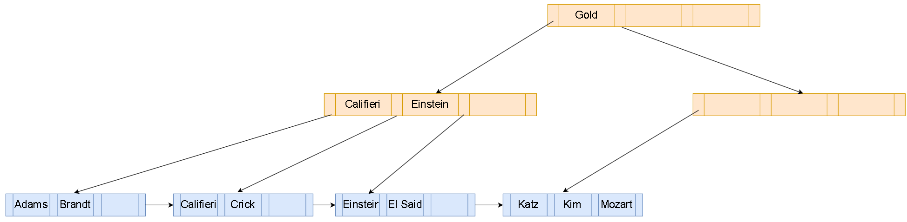

树中第二层右边那个internal node只有一个children，处于underfill状态，此时可以执行合并或者重新分配策略，用于演示，在书本中选择的是合并。

对于nonleaf node的合并来讲，需要将特定的parent key移动到合并的节点。

这也好理解，因为parent key是区分两个child的关键，现在只剩下一个child了，但是之前的underfill child还有个空的key，但是value有用的item，这个指引功能可以由parent key代替，所以就将parent key移动到合并节点，因为之前得通过parent key能找到那个underfill child，再找到其指向的child，现在underfill child没了，通过parent key直接指引到其指向的child。

将Gold移动到左边child node，此时root只剩下一个child，但是root至少得两个child，所以root被删除。

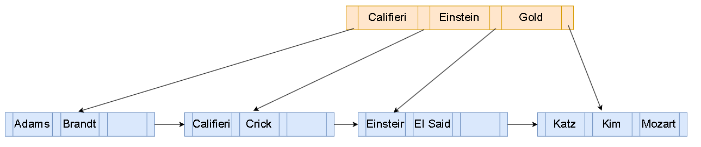

需要注意的是，"Gold"从叶子节点中删除了，但是在nonleaf node中还存在。

删除一个节点，可能还需要递归处理其父节点，极端情况下会处理到root节点，调整了整一棵树。

# Four Case

上面的流程可以大概知道删除过程什么样

一般来讲可以将删除操作抽象成四个部分：leaf node merge、nonleaf node merge、leaf node redistribute、nonleaf node redistribute

下面的图来自：[CMU 15445-2022 P2 B+Tree Insert/Delete - 知乎](https://zhuanlan.zhihu.com/p/592964493)

## Leaf Node Merge

最简单就是叶子节点合并了

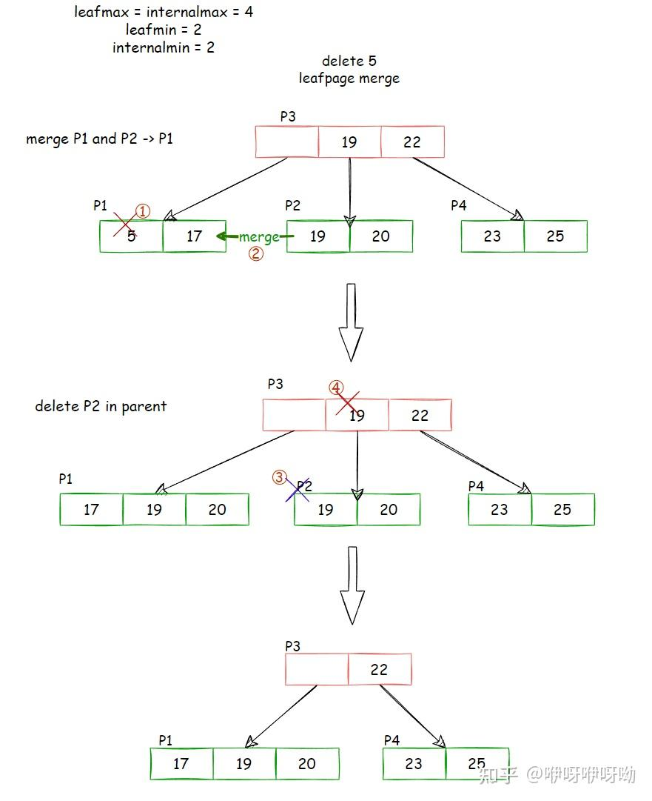

1. 删除P1节点的5
2. 合并右边兄弟节点P2到P1
3. 删除掉P2
4. 删除掉指向的P2的节点（P3中的19）

## NonLeaf Node Merge

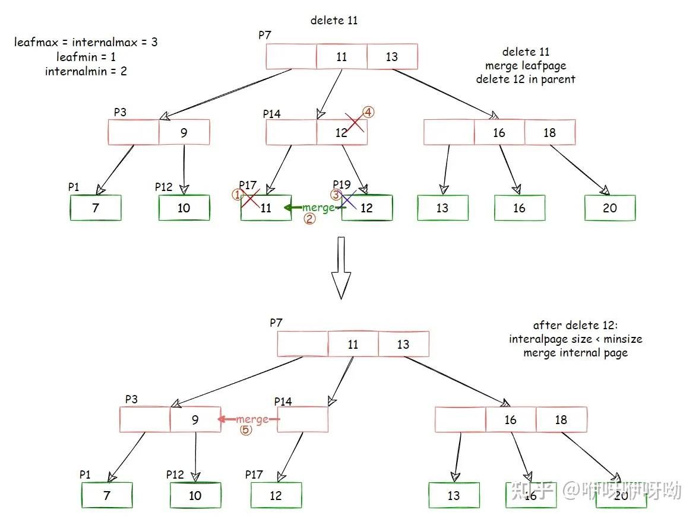

1. 删除掉P17中的11
2. 删除掉11后，不满足容量最少为1的条件，需要合并兄弟节点，这里只有一个右边的兄弟节点
3. 合并完后，P19的12移动到P17中，P19删除掉
4. P14中删除掉指向P19的节点
5. 此时P14处于underfill状态，需要merge（为了举例子暂不考虑redistribute），将P14合并到P3（见下图）
6. P7中的parent key移动到P3
7. 删除P14
8. 删除P7的指向P14的index

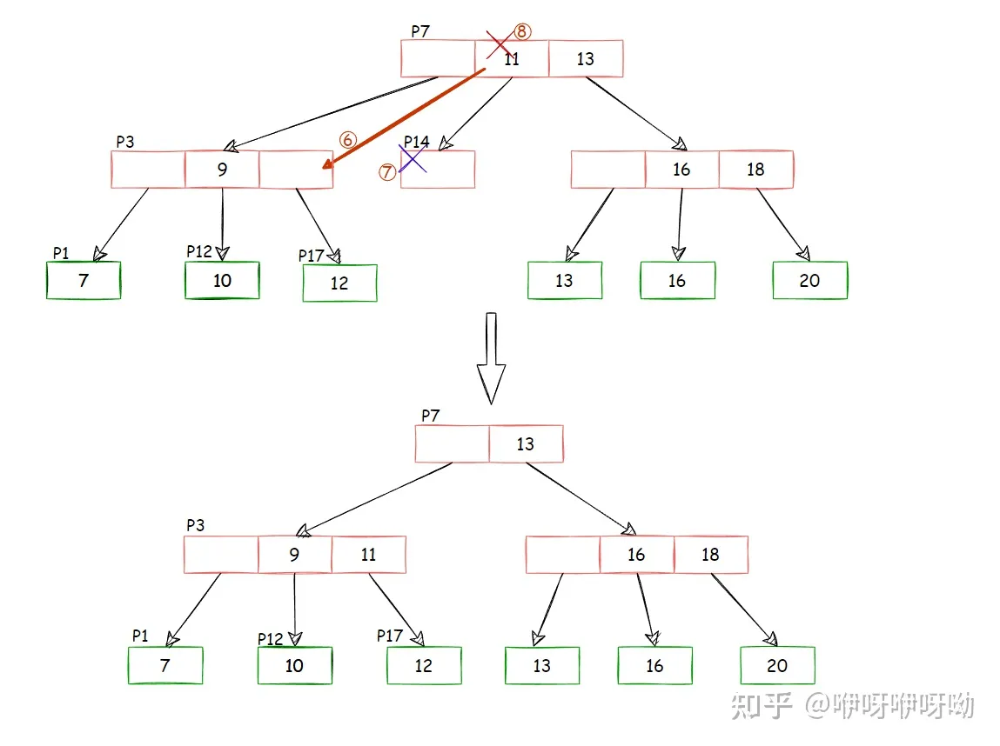

这里有一个特殊情况就是可能会造成root节点的删除（此时的策略是leaf node merge）

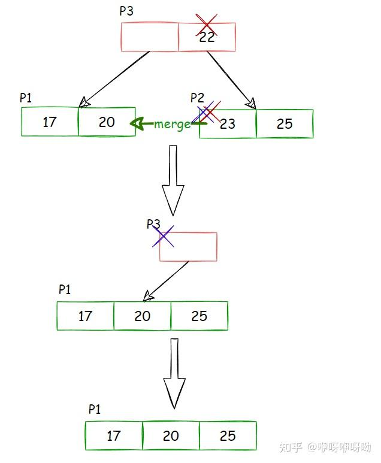

1. 删除P2的23这个节点，P2处于underfill状态
2. P2合并到P1，删除P2
3. 在P3中删除指向P2的index
4. root节点处于underfill状态，删除掉

## Leaf Node Redistribute

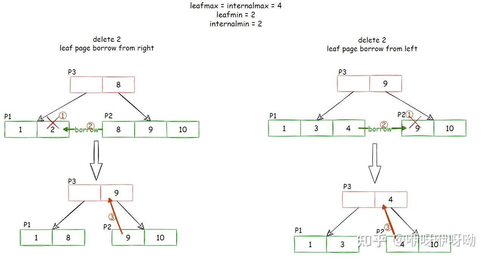

1. P1中删除2
2. 触发重新分配
3. 重新分配完成后，为了能够区分两个child，需要更改parent key

## NonLeaf Node Redistribute

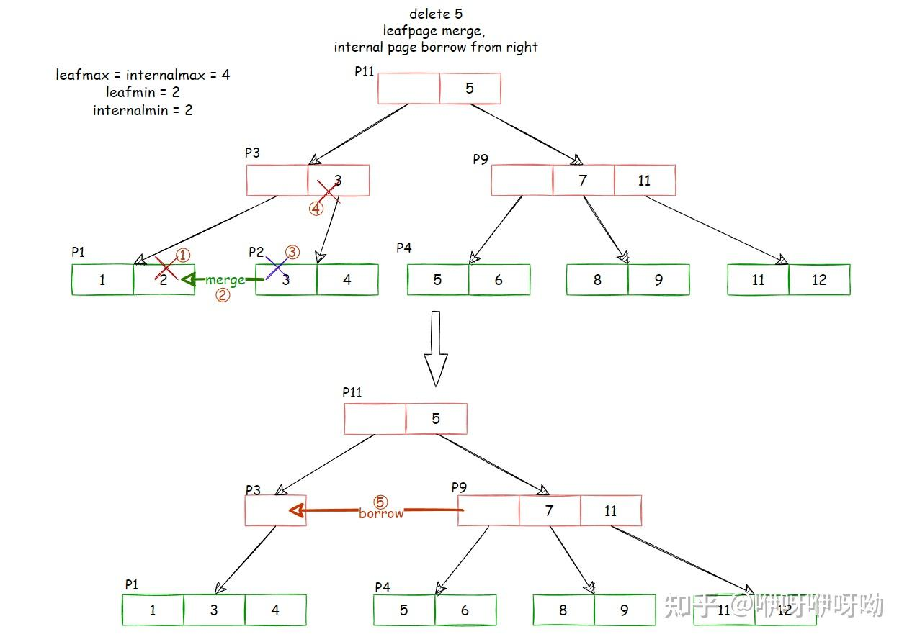

1. 从P1中删除2
2. 需要和P2进行merge（leaf node merge策略）
3. 删除掉P2
4. 在P3中删除掉指向P2的index
5. P3处于underfill状态，需要重新分配
6. 为了保持相对大小的关系不变，这里可以直接将parent key 5移动到P3
7. 那么相对应的将P9中的7移动到P11

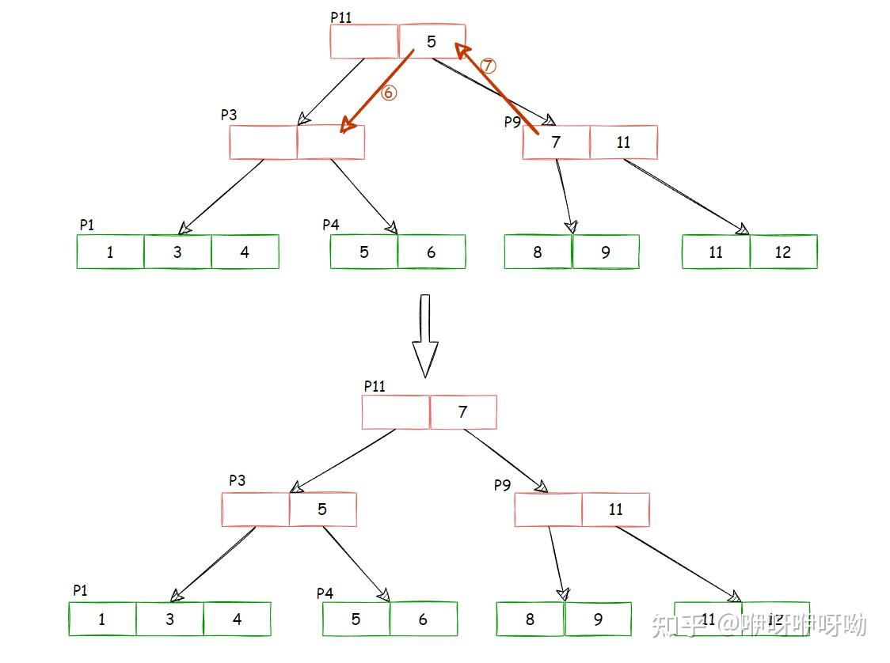

---

For more：

- [B+树的删除 - 知乎](https://zhuanlan.zhihu.com/p/375685969)