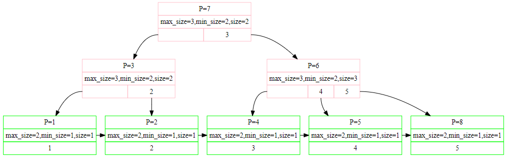
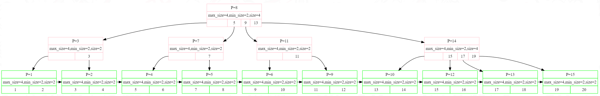
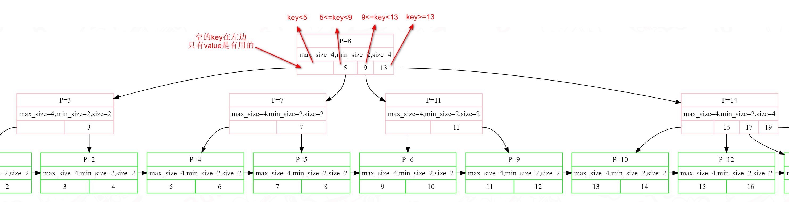
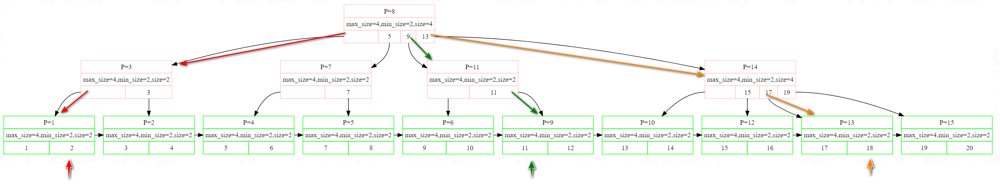

单线程版 B+树插入操作

# Overview
- **Index**: The index in database system is responsible for fast data retrieval without having to search through every row in a database table, providing the basis for both rapid random lookups (*快速随机查找*) and efficient access of ordered records.
- **B+Tree dynamic index structure**:  It is a balanced tree in which the internal pages direct the search and leaf pages contains actual data entries.
# B+ Tree properties
1. Each node except root can have a maximum of `M` children and at least `ceil(M/2)` children.
2. Each node can contain a maximum of `M–1` keys and a minimum of ceil `(M/2)–1` keys.
3. The root has at least two children and at least one search key.
4. While insertion overflow of the node occurs when it contains more than `M–1` search key values.
-  `M` is the order of B+ tree. It means every node of that Tree can have a maximum of N children.
For more:
[Introduction of B+ Tree - GeeksforGeeks](https://www.geeksforgeeks.org/introduction-of-b-tree/#)
# Tree Node
举例一个实现后的 b+ tree 如下：



如果是更大的树，则如下图所示：


设计思考点：
如果要实现一个 tree，首先得考虑每个节点在内存中是怎么组织的，也就是有哪些关键属性，怎么在内存中管理这些 node。

## BufferPoolManager
把 node 再抽象点，其实也不过就是某一块内存数据，在 db 中，内存的管理由BufferPoolManager (bpm) 接管，也就是 lab1 实现的部分。
其管理的单位是 page，也就是每次向 bpm 申请一块内存，返回的都是一个 page，其实在 cpp 中表示就是一个 class Page。
每个 page 的 data_ 大小都是 4096bytes，node 的数据就存放在此。当然 page 还有其他属性，比如 page_id 等，当作 metadata 好管理各个page。
```c++
static constexpr int BUSTUB_PAGE_SIZE = 4096;

class Page {
	public: 
	Page() { ResetMemory(); }
    //...

    protected:
    static constexpr size_t OFFSET_PAGE_START = 0;
    //...
    
    private:
    char data_[BUSTUB_PAGE_SIZE]{};
	inline void ResetMemory() { memset(data_, OFFSET_PAGE_START, BUSTUB_PAGE_SIZE); }
	//...
}
```
## Page
- 对于 B+Tree 来讲，leaf node 和 internal node 是不一样的，所以这里在 lab 中对应的是 class BPlusTreeInternalPage 和 class BPlusTreeLeafPage，也就是得把从 bpm 申请来的 class Page 中的 data_ 转换为对应 node page。转换的方法是使用 reinterpret_cast：
	```c++
  auto *page = reinterpret_cast<InternalPage *>(buffer_pool_manager_->FetchPage(page)->GetData());
	```
	
	这里的意思可以简单理解为：不管你是 InternalPage 还是 LeafPage，实际在代码表示就是一串 byte，这些 bytes 存储在 bpm 的 Page 中，在实际使用中才将其表达为是 InternalPage 还是 LeafPage。
- InternalPage 和 LeafPage 都有一个属性 `std::pair<KeyType, ValueType> array_`
	- 对 internal node 来讲，这里存储的是 key (search field) 和 child pointer，key 作为一个索引从而能定位到某个 leaf node，child pointer 是为了找到下一级节点。这里 child pointer 其实就是 page_id，因为根据 page_id 能从 bpm 中 fetch 到对应 child page。
	- 对于 leaf node 来讲，这里存储的是 key (search field) 和 RID，RID 用于定位实际的 tuple 存放位置。
	- 这两个 node KeyType 都是一样的，但是 ValueType 不一样，page_id 实际类型是 size_t，RID 实际类型是 class RID，所以有
	  ```c++
	  #define INDEX_TEMPLATE_ARGUMENTS template <typename KeyType, typename ValueType, typename KeyComparator>
	  #define MappingType std::pair<KeyType, ValueType>
	  
	  class BPlusTreePage {
	      //...common field
	  }
	  
	  INDEX_TEMPLATE_ARGUMENTS
	  class BPlusTreeInternalPage : public BPlusTreePage {
	      //...
	      private:
	        MappingType array_[1];
	  }
	  
	  INDEX_TEMPLATE_ARGUMENTS
	  class BPlusTreeLeafPage : public BPlusTreePage {
	      //...
	      private:
	        MappingType array_[1];
	  }
	  
	  class BPlusTree {
	    using InternalPage = BPlusTreeInternalPage<KeyType, page_id_t, KeyComparator>;
	    using LeafPage = BPlusTreeLeafPage<KeyType, ValueType, KeyComparator>;
	  }
	  
	  template class BPlusTree<GenericKey<4>, RID, GenericComparator<4>>;
	  template class BPlusTree<GenericKey<8>, RID, GenericComparator<8>>;
	  template class BPlusTree<GenericKey<16>, RID, GenericComparator<16>>;
	  template class BPlusTree<GenericKey<32>, RID, GenericComparator<32>>;
	  template class BPlusTree<GenericKey<64>, RID, GenericComparator<64>>;
	  ```
	
	  class BPlusTree template对应的ValueType是RID，但是InternalPage写的是page_id_t (size_t)，并不是直接沿用ValueType。
	
	  因为KeyType是自定义类型，所以需要提供一个KeyComparator来定义怎么比对两个Key的大小。
	
	- `MappingType array_[1];`用法是Flexible array，简单来讲就是，当`array_`写在类属性最后一个时，`array_`的大小自动指定，不用手动计算，其实就是这样算的：因为一个page是4kb，除去其他属性和元数据的内存开销，剩下的内存全给`array_`，然后根据`array_`中每个元素占用多少空间，从而计算出`array_` size是多少。For more: [做个数据库：2022 CMU15-445 Project2 B+Tree Index - 知乎](https://zhuanlan.zhihu.com/p/580014163)
	
- 从图上可以看到，internal node array_有一个entry中的key是空的，其value指向下一个节点。至于为什么是空的，其实也很好理解，从第二个node起每个都有特定的范围表示，剩下的有没有key都无所谓，因为其表示的范围可以推算出来。所以对于internal node而言，总共有m个key，m+1个value。具体将这个空的key放在左边或者右边都可以，这会影响到插入、删除、查找等操作。对于leaf node而言，则没有无用的key，每个key和value都是有用的。
  

# Find Leaf Node

如何根据一个key找到对应的leaf node呢（key可能在最终找到的leaf node，也可能没有）



查找部分分为两个，一个是在internal node里面查找，最终定位到leaf node；另外一个是在leaf node中查找有没有这个key


# Insert

## No Overflow

正常情况下的插入是先从根节点一直遍历到
