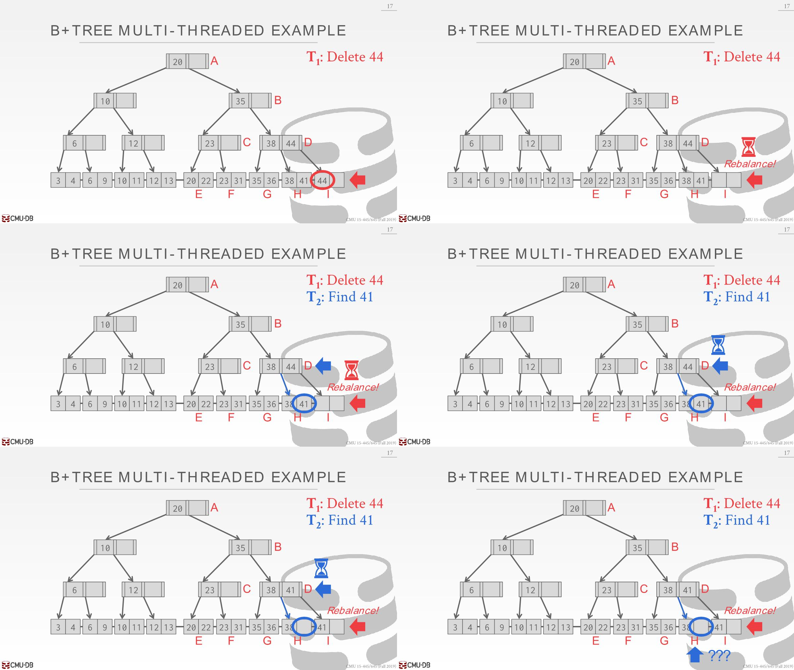
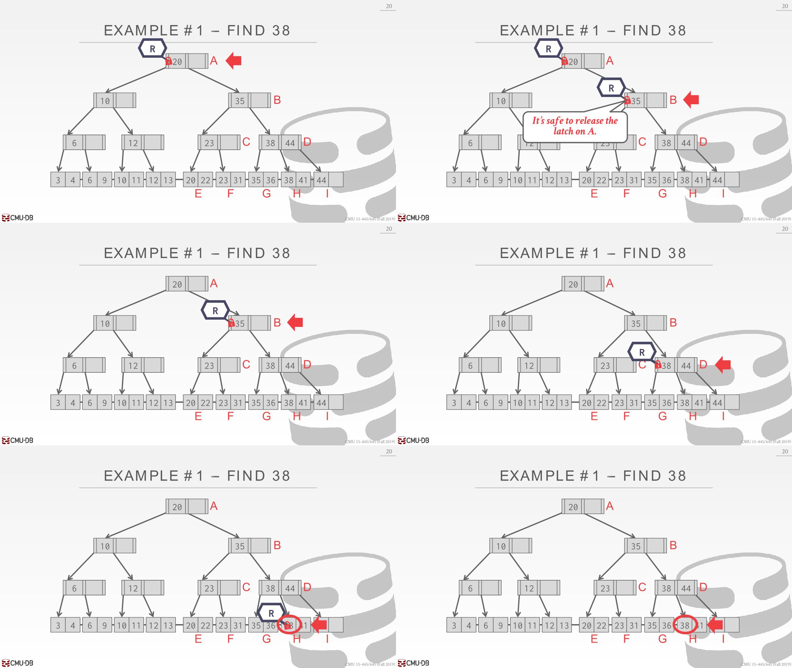
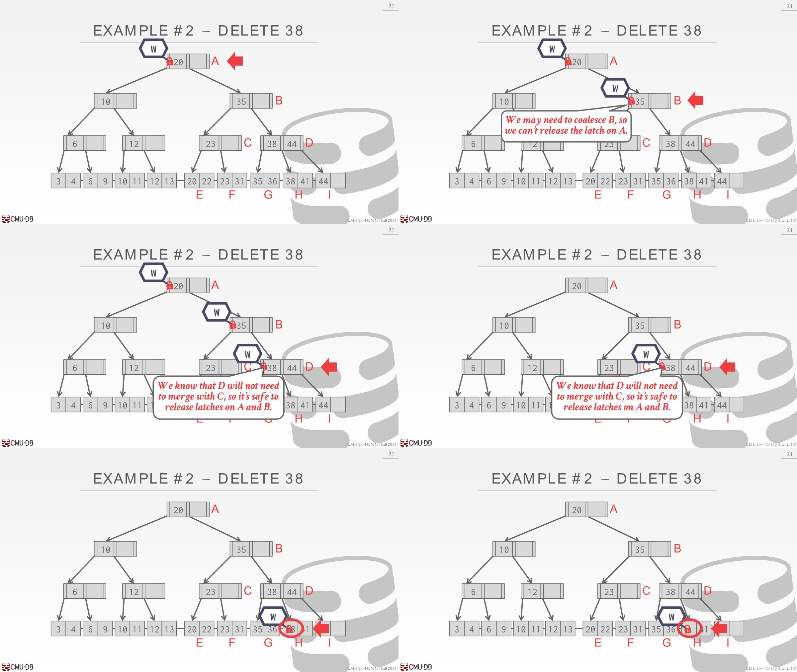
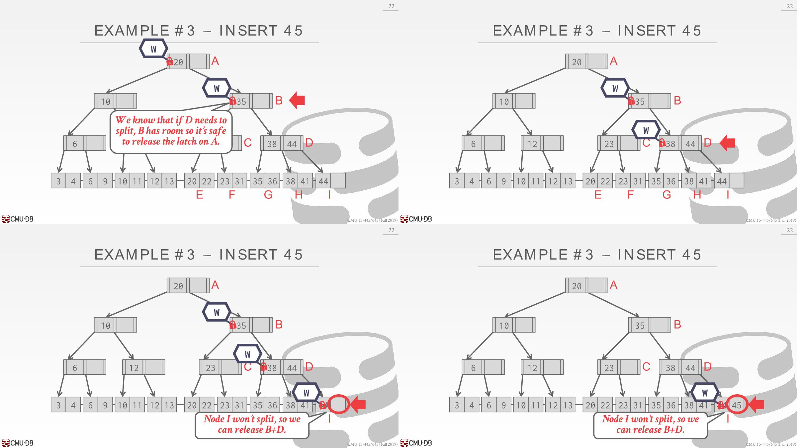
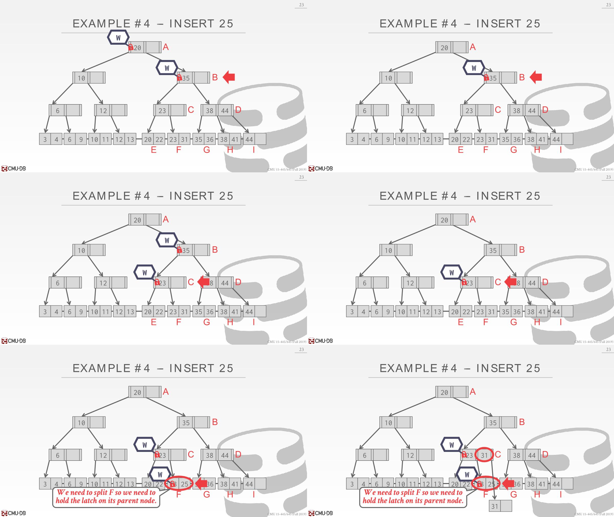
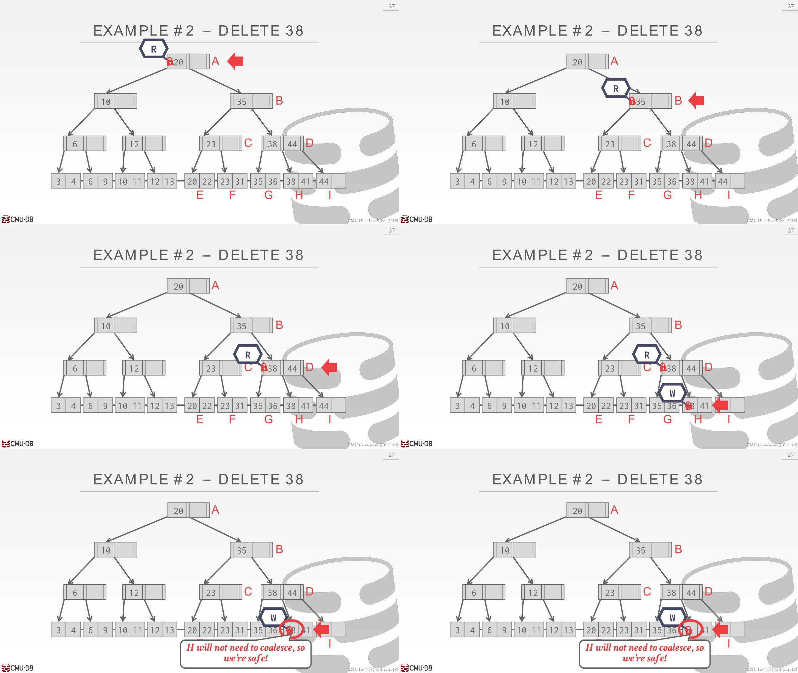
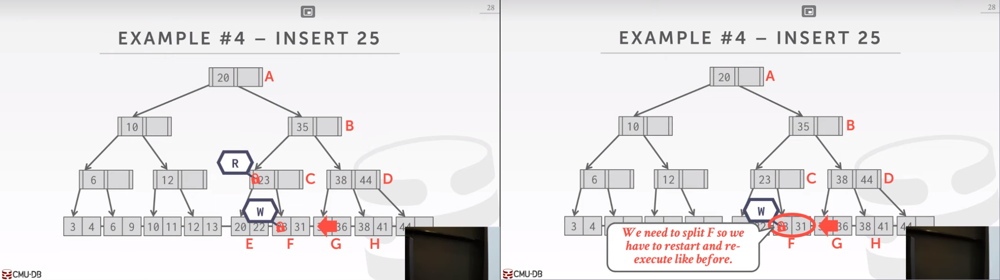

# Thread Unsafe

多线程操作B+树可能出两个问题：

- Threads trying to modify the contents of a node at the same time. 
- One thread traversing the tree while another thread splits/merges nodes.

如下一种情况是：



1. first thread(T1)想要删除44，先执行查找算法，找到对应的leaf node `I`
2. 然后删除了44，这时候node `I`处于unfill状态，需要执行redistribute操作（将左边兄弟节点的一个item复制到node `I`）
3. 在执行redistribute之前，os调度了另外一个线程(T2)执行，暂停了T1，T2想要查找41
4. T2遍历到了`CD`层，并要接着进一步遍历的时候被暂停
5. os调度到T1，T1执行redistribute操作，将node `H`的41移动到node `I`
6. 此时切换到T2执行时候，T2遍历到了node `H`，发现node `H`并没有41，但是实际上是有的，这就造成了问题

所以需要一些措施保证在并发情况下操作B+树的正确性，其中的一个经典的方法是 latch crabbing(或者叫做latch coupling)

# Latch Crabbing

- Latch crabbing/coupling is a protocol to allow multiple threads to access/modify B+Tree at the same time.

- 其基本思想是：

  1. 先获取parent的latch

  2. 再获取child的latch

  3. 如果child是safe的，则释放parent的latch

- A  `safe` node is one that will not split, merge, or redistribute when updated. In other words, a node is `safe` if

  - for insertion: it is not full.

  - for deletion: it is more than half full.

## Search

- Search: Start at the root and go down, repeatedly acquire latch on the child and then unlatch parent.



1. 从root开始查找，在root处获取一个read latch
2. 接着遍历到node B，在B处获取一个read latch，因为是read-only操作，所以可以释放node A获取到的latch
3. 释放node A的latch后只剩下node B的
4. 接着遍历到node D，获取一个read latch，并释放node B的latch
5. 遍历到node H，获取一个read latch，释放node D的latch
6. 在node H读取到38，释放latch

## Delete

**Insert/Delete**: Start at root and go down, obtaining **write latches** as needed. Once child is latched, check if it is safe. If the child is safe, release latches on all its ancestors(*祖先*).



1. 在node A处获取到一个write latch
2. 遍历到node B处获取到一个write latch，但是node B此时不是safe状态，child的数量没有大于half full（因为不知道下面的节点和操作是什么，有可能要将node B的35给删除掉后要进行合并的操作）
3. 遍历到node D处获取到一个write latch，D处于safe状态，child的数量大于half full（即使是因为D的child删除掉38后要进行合并操作，然后删除掉D的一个key，但是D仍有一个child，不用进行中间节点的合并或者重新分配）
4. node D处于safe状态，可以释放掉之前获取的write latch
5. 遍历到node H处获取到一个write latch，H处于safe状态，可以释放掉node D的write latch
6. 执行删除操作，在node H处删除掉38，然后释放H处的write latch，整个操作就完成了

## Insert



1. 在root处获取一个write latch，接着遍历到node B处获取一个write latch，此时node B处于safe状态，child的数量不是满的，还可以插入一个key
2. 释放掉node A的write latch，遍历到node D获取到一个write latch，此时node D不是safe状态，因为child的数量满了，得继续持有node B的write latch（不知道下面的节点会发生什么操作，有可能会分裂node D）
3. 接着遍历到node `I`获取一个write latch，node `I`处于safe状态，有空间执行插入操作
4. 释放掉node B和D的write latch，执行插入操作，插入完成后释放掉node `I`的write latch，整个操作就完成了

在这里有个注意点，关于释放B和D的顺序

- 从正确性来看，释放顺序没有关系，如果释放D的latch先于B的latch，不会影响正确性，因为B的latch还在，不会操作到node D
- 从性能的角度看，先释放B的latch会好一点，因为这时候B的其他child可以被访问了



1. A处获取到write latch，遍历到B处于获取write latch，B处于safe状态，还可以插入一个key
2. 释放A处的write latch
3. 遍历到node C处获取一个write latch，处于safe状态
4. 释放B的write latch
5. 遍历到node F获取一个write latch
   - 因为F是满的，所以不能释放node C的write latch。
   - 因为F是leaf node，需要真正执行插入25的操作，插入后得执行split node操作。
   - 创建一个新的leaf node，将key平分掉，`23 25 31`平分成`23 25`和`31`，前者放到旧的leaf node，后者放到新创建的leaf node。完成后将31插入到parent节点。
   - 所以这里需要持有node C的write latch
   - 这里需要持有新的leaf node的write latch吗？

# Improved Latch Protocol(better latching)

- The problem with the basic latch crabbing algorithm is that transactions **always acquire an exclusive latch on the root for every insert/delete operation**.  This limits parallelism. 一次只有一个线程持有该write latch

- Instead, one can **assume** that having to **resize (i.e., split/merge nodes) is rare**, and thus transactions can acquire **shared latches** down to the leaf nodes. Each transaction will assume that the path to the target leaf node is safe, and use READ latches and crabbing to reach it and verify.做出一个乐观的假设，大部分线程不需要对叶子节点进行split或者merge操作，所以可以类似search那样使用read latch进行遍历，到叶子节点获取一个write latch就行。

- If the leaf node is not safe, then we abort and do the previous algorithm where we acquire WRITE latches.



1. 在root处获取一个read latch
2. 遍历到node B处获取一个read latch，现在是假设乐观的操作，所以像search那样可以释放node A的read latch
3. 遍历到node D处获取一个read latch，释放B的read latch
4. 遍历到H处获取一个write latch（H是leaf node，需要真正删除一个key）
5. 释放掉D处的read latch，在node H处可以安全删除38而不用merge等操作，属于乐观锁提升性能的一个案例



像上面的情况，因为node F处需要执行split操作，得中断本次操作，重新来过，也就是从root到leaf node获取的都是write latch，属于乐观锁失败的一个案例

# Implement

## Search

可以从最简单的查询开始，一开始是对root节点加锁，那么怎么对root节点加锁呢？

从root节点本质出发，其实一个节点也就是从buffer pool manager获取到的一个page转换来的，查看一下`page.h`里面定义的方法，发现正好有对应的加锁解锁方法。

那么这里对root加锁就是

```c++
auto page = buffer_pool_manager_->FetchPage(root_page_id_);
page->RLatch();
```

然后可以接着实现其他流程，拿到root节点的latch后，拿到其child的latch，然后释放parent的latch

## Insert

可以先实现一个朴素版本的，因为better latching那里，如果最终有节点调整还是需要变为朴素的方法

这时候需要调整的是search方法，改为加write latch，为此可以加个参数判断当前的操作是哪个

```c++
enum class Operation {
    Insert,
    Search,
    Delete
};
```

接着，当遍历到child的时候，还得判断child是不是处于safe状态，由此来决定应该不应该释放parent

## FAQ

### page已经加锁了，buffer pool manager怎么处理

从buffer pool manager获取到一个page，然后加锁，此时buffer pool manager处理的逻辑是啥，是不允许其他线程通过FetchPage获取到该page，还是能够接着走正常流程获取？

BFM只负责page本身的处理逻辑，比如page与磁盘的交互，page的内存分配等。page内容级别的并发控制（比如加RWLatch实现的并发控制）都需要上层应用保证。所以无论page是否有加锁，FetchPage都会返回这个page。

这次使用BFM实现B+Tree，用的螃蟹算法去保证page的并发安全，具体可以看上面。

### 待释放latch的page信息应该如何维护

对于write latch来讲，有可能一直向下获取latch而不释放parent的latch

那么释放latch的时候怎么释放之前获取的呢，所以得有个容器能够存在一些信息，等到需要释放的时候就可以从容器中拿出需要释放latch的page释放。

transaction参数里面提供了一个PageSet专门用来存放insert时候获取的write latch

释放latch之后需要unpin，怎么确定是否dirty呢

