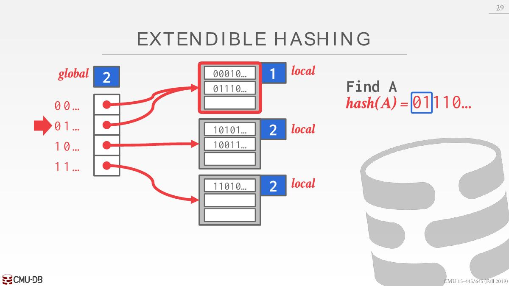
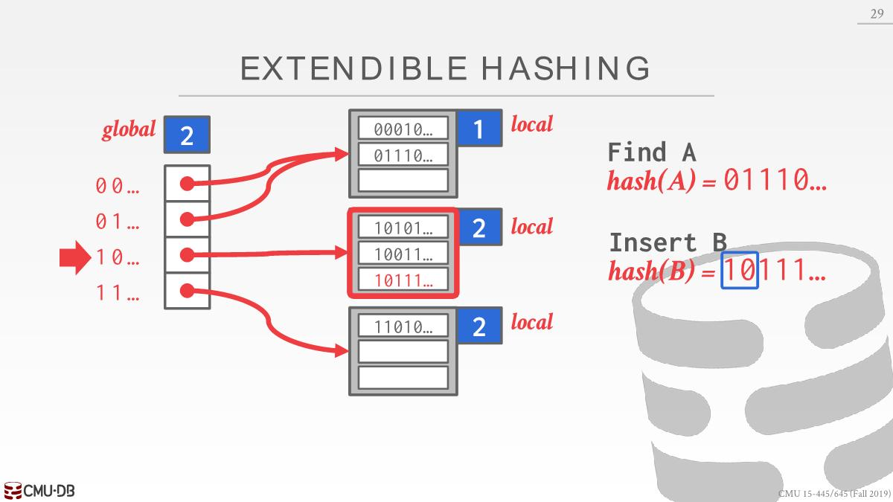
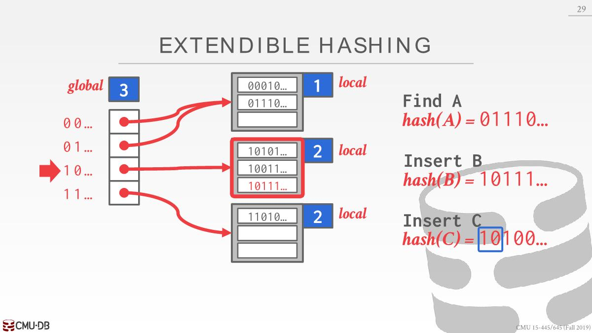
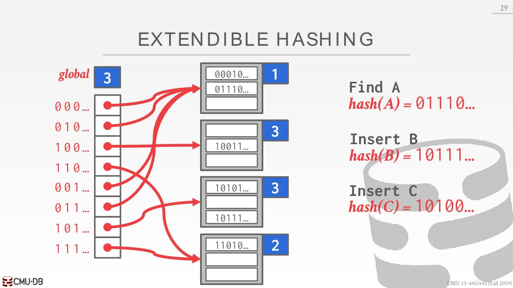
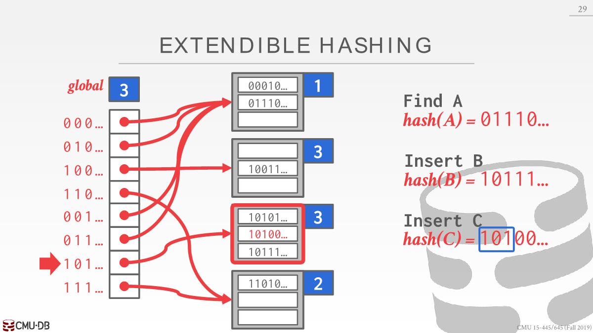
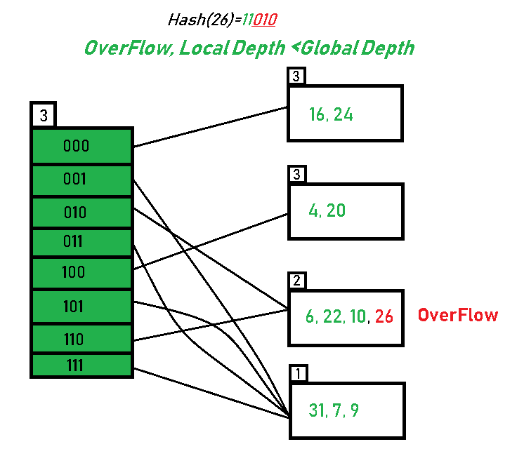
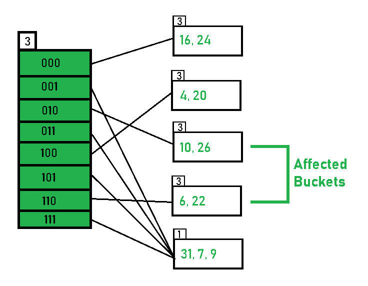

# 数据库中的HashTable

- 数据库执行引擎需要从page(主存、磁盘)中读写数据，为了提高效率，组织这些数据使用的数据结构一般是Hash Table或者Tree

- Hash Table的方案可以分为两种：static/dynamic hashing schema。
  - dynamic hashing schema能够动态调整而不至于每次重建整个table，最大化读写速度。
  - dynamic方案其中的一个实现就是ExtendibleHashTable

# ExtendibleHashTable

## 用途

- 能够使用磁盘的空间扩大table的容量，数据不局限于存储在主存中
- 插入冲突时有较好的处理性能
- 常规的hash table底层需要开辟一个比较大的数组，ExtendibleHashTable对此要求很小

## 基本结构

有两部分：**directory**和**buckets**，有一个directory和若干个bucket，可以通过directory找到buckets，可看下面查找部分。

## 查找

- global depth：找到对应的bucket需要看hash值的前几位（本文）或者后几位，根据这几位在directory里面找到bucket。directory大小就是2^global depth。

找到key为A对应的Value：

- 计算hash(A)=01110
- 此时global depth=2，查看hash(A)前两位=01，在directory中找到01的位置，指向第一个bucket
- 然后遍历第一个bucket找到对应的value

## 插入

### bucket有空闲

找到bucket，判断是否有空闲的空间插入，如果有，则插入即可

### Directory Expansion & Bucket Split

每个bucket都有一个local depth，总是小于等于global depth。如果找到的bucket没有空闲空间，分为两种情况：

`global depth = local depth`

- 将directory扩容两倍，global depth+1
- 重新映射bucket，有数量变化的bucket的local depth+1
- 映射好后重试插入
  
  
  

### 只有Bucket Split

`global depth > local depth`

- 溢出的那个bucket分裂成两个bucket，两个bucket的local depth为原本的local depth+1
- 更新directory指向bucket
- 重试插入

---

参考：

https://emunix.emich.edu/~shaynes/Papers/ExtendibleHashing/extendibleHashing.html

https://www.geeksforgeeks.org/extendible-hashing-dynamic-approach-to-dbms/

https://zhuanlan.zhihu.com/p/537292608