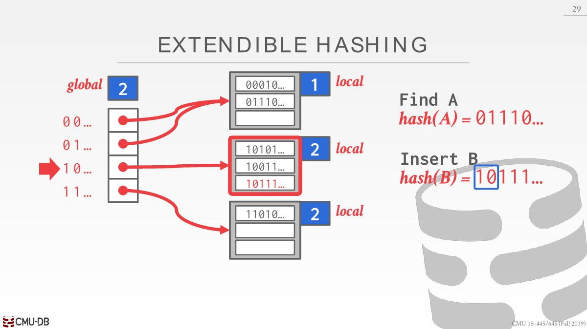

# 数据库中的HashTable

- 数据库执行引擎需要从page(主存、磁盘)中读写数据，为了提高效率，组织这些数据使用的数据结构一般是Hash Table或者Tree

- Hash Table的方案可以分为两种：static/dynamic hashing schema。
  - dynamic hashing schema能够动态调整而不至于每次重建整个table，最大化读写速度。
  - dynamic方案其中的一个实现就是ExtendibleHashTable

# ExtendibleHashTable

## 用途

- 能够使用磁盘的空间扩大table的容量，数据不局限于存储在主存中
- 插入冲突时有较好的处理性能
- 常规的hash table底层需要开辟一个比较大的数组，ExtendibleHashTable对此要求很小

## 基本结构

有两部分：**directory**和**buckets**，有一个directory和若干个bucket，可以通过directory找到buckets，可看下面查找部分。

## 查找

- global depth：找到对应的bucket需要看hash值的前几位（本文）或者后几位，根据这几位在directory里面找到bucket。directory大小就是2^global depth。

找到key为A对应的Value：

- 计算hash(A)=01110
- 此时global depth=2，查看hash(A)前两位=01，在directory中找到01的位置，指向第一个bucket
- 然后遍历第一个bucket找到对应的value

## 插入

### bucket有空闲

找到bucket，判断是否有空闲的空间插入，如果有，则插入即可

### Directory Expansion & Bucket Split

每个bucket都有一个local depth，总是小于等于global depth。如果找到的bucket没有空闲空间，分为两种情况：

`global depth = local depth`

- 将directory扩容两倍，global depth+1
- 重新映射bucket，有数量变化的bucket的local depth+1
- 映射好后重试插入
  
  
  

### 只有Bucket Split

`global depth > local depth`

- 溢出的那个bucket分裂成两个bucket，两个bucket的local depth为原本的local depth+1
- 更新directory指向bucket
- 重试插入

---

参考：

https://emunix.emich.edu/~shaynes/Papers/ExtendibleHashing/extendibleHashing.html

https://www.geeksforgeeks.org/extendible-hashing-dynamic-approach-to-dbms/

https://zhuanlan.zhihu.com/p/537292608

# Paper
## Concepts
[**P12**](obsidian://booknote?type=open-book&book=CMU445-Intro-to-Database-Systems/ExtendibleHashTable/p315-fagin.pdf&page=12)
1. $h$: fixed hash function
2. $K$: is a key
3. $K'$: $h(K)$, also $pseudokey$. 
	- We choose pseudokeys to be of fixed length, such as 32 bits. [**P12**](obsidian://booknote?type=annotation&book=CMU445-Intro-to-Database-Systems/ExtendibleHashTable/p315-fagin.pdf&id=31bfbe22-c540-21f1-bfa2-a21ee9a0d5d0&page=12&rect=60.958,172.824,408.193,196.702)
	- The pseudokeys are of fixed length, the keys need not be. [**P12**](obsidian://booknote?type=annotation&book=CMU445-Intro-to-Database-Systems/ExtendibleHashTable/p315-fagin.pdf&id=dfade0d3-6e2a-8310-196b-beb3f4b6bc65&page=12&rect=61.196,113.275,410.934,136.316)
4. $I(K)$: is associated information: either the record associated with $K$, or a pointer to the record. [**P12**](obsidian://booknote?type=annotation&book=CMU445-Intro-to-Database-Systems/ExtendibleHashTable/p315-fagin.pdf&id=d7530e75-96b9-f0bd-3094-284915de09d6&page=12&rect=61.438,77.064,409.815,100.942)
## Struct 
![[booknote/books-data/CMU445-Intro-to-Database-Systems/ExtendibleHashTable/(annots)p315-fagin.pdf/p13r101.660,457.940,369.200,655.660z2i(a0b5b3dc-bb5a-59ea-8c9a-7a66868630e8).png#center|446]]
1. **Two levels**: $directory$ and $leaves$
	- The leaves contain pairs$(K, I(K))$
	- The directory contains pointers to leaf pages [**P13**](obsidian://booknote?type=annotation&book=CMU445-Intro-to-Database-Systems/ExtendibleHashTable/p315-fagin.pdf&id=f4c60f3e-505f-3d82-22db-0f38ccc4fbe6&page=13&rect=194.397,423.355,382.881,434.396)
2. **Depth d**: the depth $d$ of the directory. [**P13**](obsidian://booknote?type=annotation&book=CMU445-Intro-to-Database-Systems/ExtendibleHashTable/p315-fagin.pdf&id=366e571c-8305-06c0-a668-88c22396655f&page=13&rect=56.156,423.355,404.496,447.262)
3. **Directory pointers**:
	- First, There is a pointer to a leaf that stores all keys $K$ for which the pseudokey $K’ = h(K)$ starts with $d$ consecutive zeros. [**P13**](obsidian://booknote?type=annotation&book=CMU445-Intro-to-Database-Systems/ExtendibleHashTable/p315-fagin.pdf&id=c6d6830d-1b0d-8e26-1c2e-b2f35367c4d9&page=13&rect=56.396,399.384,403.876,422.636)
	  directory第一个指针指向的leaf中所有的$K$有下面的特征：$K'$前$d$位都是0
	- 第二个指针指向的leaf中所有的$k'$前$d$位是`0...01`，第三个是`0...010`，后面以此类推。
	- 所以directory总共$2^d$个pointer
4. **Locate $K$**: 
	- 计算出$K'$,  找出其前$d$位.  [**P13**](obsidian://booknote?type=annotation&book=CMU445-Intro-to-Database-Systems/ExtendibleHashTable/p315-fagin.pdf&id=49d8dd71-e27c-e46a-e7b4-1932c5d5473e&page=13&rect=56.880,315.864,401.173,340.462)
	- 经过简单计算找到这$d$位对应的是directory哪个pointer
	- 然后可以找到leaf
5. **Leaf header**:
	- Each leaf page has a header that contains a local depth $d’$ for the leaf page. [**P13**](obsidian://booknote?type=annotation&book=CMU445-Intro-to-Database-Systems/ExtendibleHashTable/p315-fagin.pdf&id=bf9c433f-5cf4-84b6-e14b-fab71d323af1&page=13&rect=66.960,268.584,406.378,280.702)
	- 举例directory中 `000` pointer指向的leaf: Local depth 2 means that not only does this leaf page contain all keys whose pseudokey begins with 000, but even more, it containsall keys whose pseudokey begins with the 2 bits 00. Thus the 001 pointer alsopoints to this leaf page. [**P13**](obsidian://booknote?type=annotation&book=CMU445-Intro-to-Database-Systems/ExtendibleHashTable/p315-fagin.pdf&id=d1eadb54-2717-dc1e-3c19-4a9ed63d56dc&page=13&rect=57.357,208.795,406.191,255.836)
	- $d' <= d$

## Leaf overfills
### d' < d
- 假设figure8最后一个leaf插入新数据后溢出（判断基准可以是数据个数超过leaf容量或者容量的90%等），并且此时$d'<d$。
- It "splits" into two leaf pages, each with local depth 2. (之前是local depth 1):
	- All keys whose pseudokey begins `10` appear on the first of these leaf pages,
	- and all keys whose pseudokey begins `11` appear on the other. [**P13**](obsidian://booknote?type=annotation&book=CMU445-Intro-to-Database-Systems/ExtendibleHashTable/p315-fagin.pdf&id=0931871f-be36-eaa7-6fb0-c44e46904b3f&page=13&rect=57.597,113.995,405.268,160.556)
![[booknote/books-data/CMU445-Intro-to-Database-Systems/ExtendibleHashTable/(annots)p315-fagin.pdf/p14r114.190,421.530,377.820,655.790z2i(5dd2a543-b45c-f558-4ca9-c2a0417c0607).png#center|439]]
### d' = d 
如果溢出时$d'=d$，假设directory中010指向的leaf发生此情况：
- Then the directory doubles in size, it![[booknote/books-data/CMU445-Intro-to-Database-Systems/ExtendibleHashTable/(annots)p315-fagin.pdf/p14r111.580,151.380,377.160,420.220z2i(bd1718b0-a251-355c-816e-f15241f8970f).png#center|443]]s depth increases by 1, and the leaf page splits. [**P13**](obsidian://booknote?type=annotation&book=CMU445-Intro-to-Database-Systems/ExtendibleHashTable/p315-fagin.pdf&id=246482a1-a73a-636c-b864-549c5377656f&page=13&rect=57.839,79.195,405.719,101.756)
  ![[booknote/books-data/CMU445-Intro-to-Database-Systems/ExtendibleHashTable/(annots)p315-fagin.pdf/p14r111.580,151.380,377.160,420.220z2i(bd1718b0-a251-355c-816e-f15241f8970f).png#center|443]]
- 一百万个key时，directory double时间少于1s，十个亿极端情况下，时间少于60s
- 为了容易理解，这里使用prefix bits，如果使用suffix bits，directory double会容易很多

# 后续随想
1. 将page fault与之关联起来
2. 进一步思考directory double时主存、磁盘、速度细节
3. 优缺点
4. 如何组织leaf中的数据
5. 涉及到删除操作应该怎么处理

# overfill
$d>d'$，只拆分leaf，不double directory，可以根据里面所有的key找到对应的directory index再重新映射到leaf。
为什么这里面拆分就能保证leaf有空间，还是得回归到local depth的意义上面来，比如local depth=2，global depth=3，local depth只等于2，代表leaf中所有的$k'$只是前两位相同，所以少了一位去辨别。
那么split bucket一定能保证对应的key被分散来吗，感觉是不一定的，有可能还是会落到同一个bucket，导致没有被分散。先跳过考虑这个，也许实验没有出现这个情况

![[hash-第 1 页.jpg]]

# discord
https://discord.com/channels/724929902075445281/1014055928619872276/1028926737544921099
Extendible hashing explanation
HI, this is my aftempt at cleaning up an explanalion of extenditble hashing from my OH earier. Im postingt here in case anyone eise finds it helpful

Convention 
First, when deciding which element maps to which bucket, note that lecture uses the first N bis' convenfion whereas the programming and homework uses the Tast N bits' convention. In this post, we use the "last N bits"(lsb) convention.

Extendible hashing 
Roughly speaking, the extendible hash table's directory is used to maintain equlvraience classes of at most bucket_sire many elements. EBements in the same bucket have the same equlvalence class
(e.g, their last locol_depth many bits are all the same). The directory's elobal_depth tracks ihat the hlghest bucket local_depth ls.
An extendible hash table starts at globaf depth 0, pointing to a single bucket-everything is urmped into the same equlvalence cdass. When we try to fnsert an element, we hash the element and look at the last global_depth many bits to figure out wfhich bucket it should go to.
Once we identtly the bucket that the element beiongs in, there are two possibllnes. Either the bucket has space,n which case we just insert the element. Or the bucket is ful, In which case we must splt the bucket.
Conceptually, splitting the bucket is saying that "there are more than bucket_sie many elesents in this equivalence class already, so we need to make more equlvalence classes/use an adaitional bit to distinguish between elements in this class'. Therefore, spliting the bucket increases the focal depth of the bucdket, which may increase the global depth resulting in a doubling of the directory. We' ll walk through an example,
(elements wl be writen in binary. eg.,000is 0,100is4)
Suppose you have this extendible hash table setup (bucket_size is 2,31obal_sapth s2

# Textbook
- $i$ : global depth
- $i_j$ : bucket j local depth

## Double Directory
$i = i_j$
Why double:
- only one entry in the bucket address table points to bucket j.
- Therefore,the system needs to increase the size of the bucket address table so that it caninclude pointers to the two buckets that result from splitting bucket j.
- It does so by considering an additional bit of the hash value.[**P1226**](obsidian://booknote?type=annotation&book=book/Database-System-Concepts.pdf&id=043ae5fa-2900-379b-c167-b0ffa568dae8&page=1226&rect=179.758,435.342,530.971,488.041)

How:
1. It **increments the value of i by 1**, thus doubling the size of the bucket address table. 
2. It **replaces each entry with two entries**, both of which contain the same pointer as the original entry. 
3. Now two entries in the bucket address table point to bucket j.[**P1226**](obsidian://booknote?type=annotation&book=book/Database-System-Concepts.pdf&id=56d03803-ac09-d0f3-2e0d-c1c2215ad4ef&page=1226&rect=179.758,396.502,531.010,446.849)
4. The system **allocates a new bucket** (bucket z) and sets the **second entry to point to the new bucket**. It sets $i_j$ and $i_z$ to $i$.[**P1226**](obsidian://booknote?type=annotation&book=book/Database-System-Concepts.pdf&id=f0a05f45-e00e-eb2e-1856-bf09d9a93b61&page=1226&rect=179.758,369.705,530.983,408.029)
5. It **rehashes** each record in bucket j and, depending on the first i bits (remember the system has added 1 to i), either **keeps it in bucket j or allocatesit to the newly created bucket**.[**P1226**](obsidian://booknote?type=annotation&book=book/Database-System-Concepts.pdf&id=1a0b051e-0893-e42a-f28a-038d980c9388&page=1226&rect=179.761,344.682,531.042,382.109)
6. The system now **reattempts the insertion of the new record**. Usually, the attempt will succeed.
7. However, if all the records in bucket j, as well as the new record, have the **same hash-value prefix**, **it will be necessary to split a bucket again**, since all the records in bucket j and the new record are assigned to the same bucket.[**P1226**](obsidian://booknote?type=annotation&book=book/Database-System-Concepts.pdf&id=0b2b094c-4358-9fc0-754c-ff76a675b056&page=1226&rect=179.759,292.882,530.929,343.289)
8. 一般情况下如果选择的是合适的hash函数，那么一次split即可。极端情况下会退化生成静态hash那样解决冲突（应该是设定最大的directory depth）
## Split Only
$i > i_j$

Why split only:
- more than one entry in the bucket address table points to bucket j.
- Thus, the system can split bucket j without increasing the size of the bucket address table.[**P1226**](obsidian://booknote?type=annotation&book=book/Database-System-Concepts.pdf&id=960b7578-6ecf-f2ce-71ff-4c5bfed09b5f&page=1226&rect=179.759,183.261,530.913,223.021)

How:
1. The system **allocates a new bucket**(bucket z), and sets $i_j$ and $i_z$ to the value that results from adding 1 to the original $i_j$ value.[**P1226**](obsidian://booknote?type=annotation&book=book/Database-System-Concepts.pdf&id=e6c69ef9-c76b-9a94-afdf-bd50048362df&page=1226&rect=179.760,142.247,530.914,179.728)
2. , as in the previous case, the system rehashes each record in bucket j,andallocates it either to bucket j or to the newly created bucket z.[**P1227**](obsidian://booknote?type=annotation&book=book/Database-System-Concepts.pdf&id=f58ac39c-d85a-3650-d46f-26359b8bc012&page=1227&rect=148.320,465.202,499.487,489.629)
3. As in the previous case, the system **rehashes** each record in bucket j,and allocates it either to bucket j or to the newly created bucket z.[**P1227**](obsidian://booknote?type=annotation&book=book/Database-System-Concepts.pdf&id=8c4c39aa-b2d1-bd23-600d-5328d08a92ee&page=1227&rect=148.320,465.202,499.487,489.629)
4. The system then reattempts the insert. In the unlikely case that it again fails, it applies one of the two cases, $i = i_j$ or $i > i_j$, as appropriate.[**P1227**](obsidian://booknote?type=annotation&book=book/Database-System-Concepts.pdf&id=04db9f46-bde3-cceb-a505-e4fca7c23c0b&page=1227&rect=148.321,437.087,499.526,463.769) 失败重试后可能需要double directory

Note that, in both cases, the system needs to recompute the hash function on only the records in bucket j.[**P1227**](obsidian://booknote?type=annotation&book=book/Database-System-Concepts.pdf&id=1975cd5b-853e-e3c0-7aac-5e707560a286&page=1227&rect=128.880,398.661,499.474,423.149)
