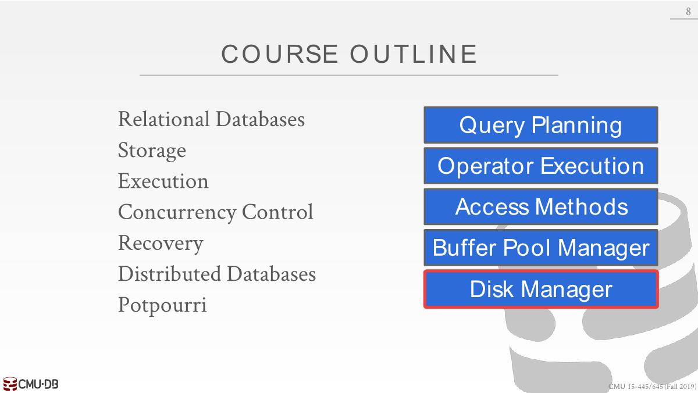

# CMU 15-445/645-Intro-to-Database-Systems

- [Schedule](https://15445.courses.cs.cmu.edu/fall2019/schedule.html)
- Course Outline
  

---

Record=Row=Tuple=Entry

[SQL: What is a tuple? - Quora](https://www.quora.com/SQL-What-is-a-tuple)
