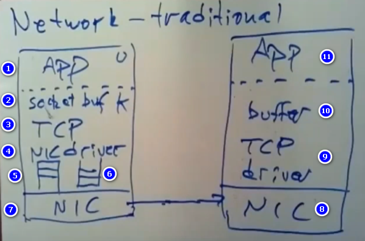
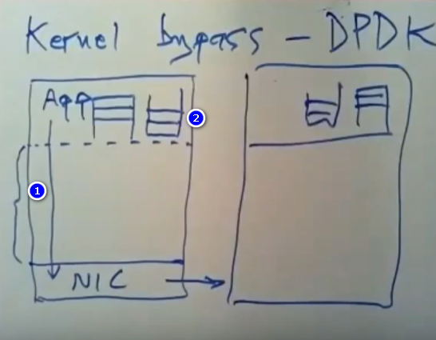
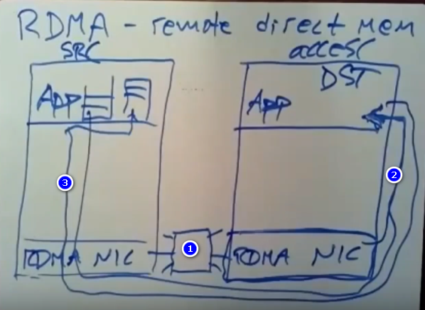

# FaRM

## why are we reading about FaRM

- transactions+replication+sharding
- RDMA NIC巨大的性能潜力

## FaRM对比Spanner

- 两者共同：replicate、2PC
- Spanner：

1. 已经完善且部署的系统
2. 专注于跨DC复制同时处理不同地方的数据的事务能力高效
3. 只读事务TrueTime
4. r/w事务需要10~100ms
5. 主要瓶颈：卫星信号传播上的延迟、DC之间的网络延迟

- FaRM：

1. 研究型，探索RDMA
2. 所有replica都在同一个DC
3. RDMA限制了系统的设计：必须使用Optimistic Concurrency Control (OCC)
4. 简单事务只需要58microseconds，比Spanner快100倍
5. 主要瓶颈：服务器上的CPU时间

## 整体设计

- Zookeeper+configuration manager，决定存储每个数据分片的服务器哪个是primary哪个是backup
- 每个数据分片分散到一堆primary/backup replication上，比如一个数据分片对应P1、B1，另一个对应P2、B2

    ```shell
    P1 B1
    P2 B2
    ...
    ```

    只要每个分片有一个可用的replica，系统就依旧可用， f+1 replicas tolerate f failures
- transaction clients（位于服务器上）充当Transaction Coordinator(TC)

## 高性能

- 数据分片到许多服务器(评估90台)上并行处理
- 所有数据位于RAM，使用非易失（non-volatile） RAM避免供电故障
- RDMA、kernel bypass

## NVRAM

- 不是写入磁盘，消除了巨大的瓶颈。RAM写入需要200ns（nanoseconds），磁盘写入需要10ms（milliseconds），SSD写入需要100us（microseconds）
- 整个DC的电源发生故障后，可能会影响所有的机器。
  - 所以FaRM为每个服务器准备了电池，让机器再坚持10分钟左右。
  - 发生故障后电源系统会通知FaRM，FaRM服务器上的软件会停止所有的事务处理，将每台机器上的RAM数据写入SSD，然后机器关机。
  - 重启后FaRM从SSD恢复RAM中的数据。
  - 本质上，FaRM使用后备电源做到RAM的非易失性，避免供电故障。只对供电故障有用，由于软件bug等导致的崩溃无效，机器重启并丢失RAM所有的内容。这就是为什么除了使用NVRAM以外，FaRM还得为每个数据分片建立多个replica的原因。
- 所以，NVRAM消除了持久性写入的瓶颈，让网络和CPU成为剩下的瓶颈。

## 为什么网络经常是性能瓶颈



1. app运行于用户态，为了发送数据，app得使用内核中的系统调用并且成本不低。
2. socket层会对数据进行缓存，涉及到复制数据，需要花些时间。
3. TCP协议栈，重传、序列化、checksum、flow control等
4. NIC驱动通过NIC往主机内存读取和写入数据包
5. 类似于队列的东西，放着NIC通过DMA访问内存时所拿到的数据，等待内核读取这个队列中的数据包
6. 用于对外发送数据的数据包队列，NIC可以尽可能将数据发送出去
7. NIC通过电缆将bit信息发送到网络上的硬件
8. NIC收到数据包后发送中断信号给内核
9. 内核通过驱动将数据包发送给TCP进行处理
10. 数据包写入buffer，等待应用程序读取数据
11. app读取数据通过系统调用将内核buffer中的数据拷贝到用户态空间。

- CPU耗时操作：系统调用、复制消息、中断。在这种架构下很难做到每秒传输十万个RPC消息（基本远远小于NIC通过网线传输10Gb/s的上限），并且数据库通常需要使用的信息大小很小，在这种情况下，我们很难去写一个RPC软件，使之每秒能够生成10Gbit大小的消息。

## FaRM减少发送数据包的成本措施

### kernel bypass



1. 与其让应用程序通过调用复杂的内核代码来发送所有数据，直接通过对内核保护机制进行配置，以此来让应用程序直接访问NIC（没有系统调用，没有经过内核，没有中断）

2. 通过DMA，app能直接访问应用程序内存，在不需要内核参与的情况下，应用程序可以直接看到接收到的数据包信息。并且发送数据包时候，应用程序也能去创建一些队列，NIC可以直接通过DMA来读取用户RAM数据，并通过网线将数据发送出去

- 最新的NIC可以通过NIC设置达到这一点，需要应用程序去自行处理TCP那些事情。kernel bypass使用了DPDK的工具包，DPDK则采用轮询方式实现数据包处理过程：DPDK重载了网卡驱动，该驱动在收到数据包后不中断通知CPU，而是将数据包通过零拷贝技术存入内存，这时应用层程序就可以通过DPDK提供的接口，直接从内存读取数据包。

- 正常情况下，应用程序代码是不能直接对设备进行任何操作，最新的Linux可能已经支持该功能：让内核将硬件访问的权限委派给应用程序。

### RDMA

RDMA（remote direct memory access）：远程直接内存调用，使用到一种目前还没有广泛使用的硬件，是一种特殊的NIC。



1. RDMA NIC和交换机，有很多不同的服务器都和交换机连接在一起，通过它可以与任意服务器进行通信。
2. 源机（src host）可以通过RDMA系统发送一条特殊的消息来告诉NIC让它直接对目标应用程序地址空间中的内存直接进行读写操作。所以网络接口控制器上的硬件和软件会对目标应用程序的内存直接进行读写操作。
3. 目标应用程序会将响应结果返回给源应用程序的incoming queue中

- 该过程CPU并不参与，读操作或者写操作完全是在NIC的固件中执行的，不会发生中断，应用程序不用考虑请求或者响应的事情（也可以称为one-sided RDMA）。目标主机上的网络接口卡只需要去对应用程序内存进行读取或写入操作，然后将结果返回给源应用程序即可。

- 通过使用这种很神奇的kernel bypass networking，在进行简单的读和写的时候，它要远远比通过普通的RPC调用来发送信息的方式快得多。

- 支持RDMA的NIC使用的是它们自己的可靠的sequenced protocol，这和NIC间使用的TCP很像，但又不是TCP（因为没有使用到TCP，而TCP有很多可靠的保护机制，所以RDMA也有可靠机制）。当RDMA NIC去进行读或者写操作的时候，它会一直保持传送数据的状态，直到请求丢失或者它得到一个响应为止。它会去询问这个软件该请求是成功还是失败了，最后会得到一个ACK消息。

- FaRM有时候使用RDMA直接读取数据，有时候则是给目标对象的incoming message queue追加写消息，因为没有中断，所以目标机器会一直轮询内存判断有没有新消息。如果发生供电故障，message queue的数据也会写入到磁盘。

- 通过RDMA，每秒能处理1000万次读写操作。使用RDMA来进行简单的读或者写操作所导致的延迟只有5 microseconds

### RDMA与事务、replication

- 面临的挑战是如何将事务、数据分片以及replication结合在一起
- 目前所学习到的协议都是得服务器参与的，帮助client对数据进行读写。2PC上服务器得去判断一条记录有没有锁，最新的写数据是否已经被提交，Spanner得有版本号之类的东西，思考如何根据版本号找到最新的数据。
- 所以RDMA是不能直接兼容这些，因为直接写入内存，不需要请求和响应，也就没有了这些消息的交互。

## FaRM使用OCC

- 乐观机制中，可以在没有锁的机制下读取数据。不会直接写入数据，会将写操作缓存在client本地，直到事务结束后试图提交数据，会先验证是否有其他事务冲突。

- OCC能让FaRM单方面使用RDAM读取数据，服务器不用主动参与。

## FaRM transaction API

FaRM不支持SQL，而是使用了相对简单的api来支持事务。

