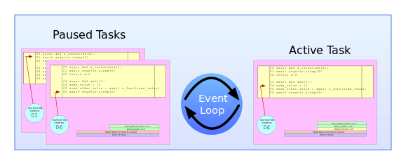

# asyncio

ref: [Python Asyncio Part 1 – Basic Concepts and Patterns](https://bbc.github.io/cloudfit-public-docs/asyncio/asyncio-part-1.html)

- asyncio 不会让代码执行变成多线程的，不会有同时执行多个Python指令和绕过[GlobalInterpreterLock](https://wiki.python.org/moin/GlobalInterpreterLock)的效果

- asyncio作用：当一个`linear single-threaded code`（称为协程"coroutine"）等待某事发生时，另一个可以接管并使CPU。所以asyncio并不是关于多核的，而是如何有效利用单核。

## Subroutines vs Coroutines

- 大多数编程语言采用一种叫做subroutine的调用方法模型（calling model），每次对函数的调用都是完整的调用。

- 还有另外一种模型是coroutine，提供了一种将执行权移回调用者的方法。当协程执行yield代码后会将执行权移回到调用它的地方，但是未来再次执行该协程时，会从最近执行停止的地方继续，而不是从头开始，这样控制可以在调用代码和协程代码之间来回。


## Event Loops, Tasks, and Coroutines

- 在asyncio世界中，每个线程不再只有一个堆栈，而是每个线程都有一个称为事件循环（Event Loop）的对象。事件循环中包含一个名为Tasks的对象列表，每个Task维护一个堆栈以及它们自己的执行指针（execution pointer）。



- 在任何时候，事件循环只能让一个任务执行，循环中的其他任务全被暂停，正在执行的任务会一直执行，直到某些等待事件发生。然后，该任务会让出控制权（yield control），这意味着事件循环会暂停它正在运行的任务。接着事件循环会唤醒一个暂停任务并执行。这样，CPU的时间可以在不同的任务之间共享。

- 事件循环不能强制中断当前正在执行的协程，直到它让出控制权。事件循环的作用是选择下一个要调度的协程，并跟踪哪些协程被阻塞和无法执行，直到某个IO完成，但它只在当前没有协程正在执行的时候做这些事情。

## Asynchronous Code

ref: [Python Asyncio Part 2 – Awaitables, Tasks, and Futures](https://bbc.github.io/cloudfit-public-docs/asyncio/asyncio-part-2)

```python
async def example_coroutine_function(a, b):
    # Asynchronous code goes here
    ...

def example_function(a, b):
    # Synchronous code goes here
    ...

# 不会运行
r = example_coroutine_function(1, 2, 3)
```

async def创建一个带有名字的可调用对象（callable object），当对象被调用时，函数的代码块不会运行，而是创建了一个Coroutine类实例并分配给r。要使代码块真正运行，需要使用asyncio提供的用于运行协程的工具，最常见的就是await关键字。

### await and awaitable


