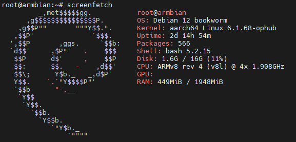
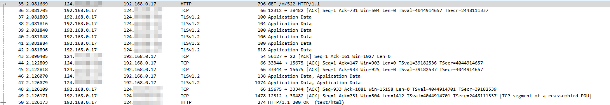
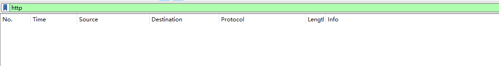
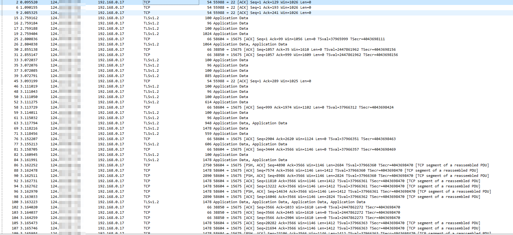
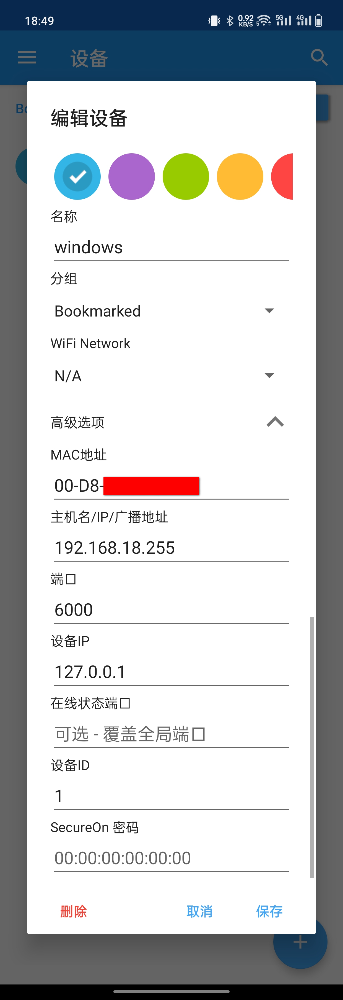

# 魔百盒

服役了两年的玩客云差不多也该换了，主要是配置方面感觉不够用，特别是当全局代理的情况下，总有断流的情况，而且是32位+1G RAM+8G ROM，小内存有点捉急。

所以就看了下有没有稍微好的产品，搜索了下发现有个魔百盒还可以，cm311-1a，2G RAM+16G ROM，amlogic s905l3a cpu对比玩客云的s805好点，内存方面也是翻倍，不到70的价格，虽然现在的价格比前一两年贵了十几二十块，但是也能接受。

买这个便宜性能凑合的盒子主要用来挂一些简单的服务，比如memos，青龙，v2raya等，还有一些内网穿透的需求



# 内网穿透

## 配置

比较安全的内网穿透软件有Cloudflare Warp、Tailscale、Zerotier等，大概都是通过VPN建议连接的，比直接开放端口可外网直接连接安全多了。

要使用这些软件，server和client都得安装一个程序，因为某些原因，我的某些client不能装类似的软件，所以只能pass了。

所以只能使用frp之类的，为了避免直接暴露端口，使用stcp/sudp协议。对于stcp/sudp而言，也得在server和client分别安装frps和frpc，但是frpc上连接stcp/sudp是得重新一个监听本地端口的，也就是说，本地frpc启动后，是通过127.0.0.1:2333（假设）访问服务的，所以某些特殊的client，可以通过局域网连接到这些端口实现，具体的配置如下：

frps: 

```toml
bindPort = 12345
auth.token = "token1"
#webServer.addr = "0.0.0.0"
#webServer.port = 12346
#webServer.user = "user"
#webServer.password = "password"
transport.tls.certFile = "/home/server.crt"
transport.tls.keyFile = "/home/server.key"
transport.tls.trustedCaFile = "/home/ca.crt"
```

魔百盒frpc：

```toml
serverAddr = "1.2.3.4"
serverPort = 12345
auth.token = "token1"
transport.tls.certFile = "/home/client.crt"
transport.tls.keyFile = "/home/client.key"
transport.tls.trustedCaFile = "/home/ca.crt"

[[proxies]]
name = "ssh"
type = "stcp"
secretKey = "token2"
localIP = "127.0.0.1"
localPort = 22

[[proxies]]
name = "rdp"
type = "stcp"
secretKey = "token3"
localIp = "192.168.18.102"
localPort = 3389
transport.useCompression = true

[[proxies]]
name = "memos"
type = "stcp"
secretKey = "token4"
localIp = "127.0.0.1"
localPort = 5230
transport.useCompression = true

[[proxies]]
name = "wol"
type = "sudp"
secretKey = "token5"
localIp = "192.168.18.255"
localPort = 9
```

client frpc连接：

```toml
serverAddr = "1.2.3.4"
serverPort = 12345
auth.token = "token1"
transport.tls.certFile = "/home/client.crt"
transport.tls.keyFile = "/home/client.key"
transport.tls.trustedCaFile = "/home/ca.crt"

[[visitors]]
name = "secret_ssh_visitor"
type = "stcp"
serverName = "ssh"
secretKey = "token2"
bindAddr = "127.0.0.1"
bindPort = 6001

[[visitors]]
name = "secret_rdp_visitor"
type = "stcp"
serverName = "rdp"
secretKey = "token3"
bindAddr = "0.0.0.0"
bindPort = 6002
transport.useCompression = true

[[visitors]]
name = "secret_wol_visitor"
type = "sudp"
serverName = "wol"
secretKey = "token5"
bindAddr = "127.0.0.1"
bindPort = 6000

```

client本地启动frpc后，比如rdp服务，因为监听了0.0.0.0:6002，所以另外一个client可以通过其局域网ip连接到rdp服务，不用单独装frpc。

## 安全

### useEncryption

> 通过设置 `transport.useEncryption = true`，将 frpc 与 frps 之间的通信内容加密传输，将会有效防止传输内容被截取。
>
> [通信安全及优化 | frp](https://gofrp.org/zh-cn/docs/features/common/network/network/)

这个的意思其实是说，它加密的是frpc客户端（提供服务的内网客户端）和frps（公网服务器）之间的连接，但是最终用户和公网服务器之间的传输该是怎么样的还是怎么样的，如果是明文http传输，那么依旧是明文http传输。

```toml
[[proxies]]
name = "memos"
type = "tcp"
localIP = "127.0.0.1"
localPort = 5230
remotePort = 6000
```



### stcp

> STCP 和 SUDP 的 (S) 的含义是 Secret。其作用是为 TCP 和 UDP 类型的服务提供一种安全访问的能力，避免让端口直接暴露在公网上导致任何人都能访问到。
>
> frp 会在访问端监听一个端口和服务端的端口做映射。访问端的用户需要提供相同的密钥才能连接成功，从而保证安全性。
>
> [STCP & SUDP | frp](https://gofrp.org/zh-cn/docs/features/stcp-sudp/)

使用stcp的配置，整个传输过程没有明文的http协议，流量通过tls协议加密。

```toml
[[proxies]]
name = "memos"
type = "stcp"
secretKey = "token4"
localIp = "127.0.0.1"
localPort = 5230
transport.useCompression = true
```





### trustedCaFile

> `transport.useEncryption` 和 `STCP` 等功能能有效防止流量内容在通信过程中被盗取，但是无法判断对方的身份是否合法，存在被中间人攻击的风险。为此 frp 支持 frpc 和 frps 之间的流量通过 TLS 协议加密，并且支持客户端或服务端单向验证，双向验证等功能。
> [自定义 TLS 协议加密 | frp](https://gofrp.org/zh-cn/docs/features/common/network/network-tls/)

这个措施是为了判断对方身份是否合法，建议还是配置一下，证书生成本地就行，而且能够多提供一层保障。

---

For more：
[提高 frp 内网穿透的安全性 - 南山崔崔的个人站点](https://cui.cc/frp-security-config/)

## Systemctl重试

某些情况下机器网络断了后，可以增加一些举措来重连，如果frp用systemctl管理，可使用以下配置

```toml
[Unit]
Description = frp server
Wants=network-online.target
After=network.target network-online.target
Requires=network-online.target

[Service]
Type = simple
ExecStart = /root/frp_0.53.2_linux_arm64/frpc -c /root/frp_0.53.2_linux_arm64/frpc.toml
ExecStop=/bin/kill $MAINPID
Restart=always
RestartSec=5
StartLimitInterval=0

[Install]
WantedBy = multi-user.target
```

## WOL

因为需要用windows进行远程，但是又省电费，所以一个举措就是当要远程的时候才唤醒电脑进行远程，平时睡眠状态，达到省钱的效果，可以使用一个叫做WOL的功能，需要的配置如下：

- Windows和Bios的配置：[[家庭实验室系列文章-电脑如何配置网络唤醒 (WOL)? - 知乎](https://zhuanlan.zhihu.com/p/585076355)](https://zhuanlan.zhihu.com/p/29100706)
  - 主要就是配置一下windows的网卡、防火墙以及bios的开启wol设置项
- frpc的配置：搜索wol，上文有帖配置
- Android的配置：
  

## 容错

目前这个内网穿透只在魔百盒里面跑，如果魔百盒出问题了怎么办，比如突然间系统卡死，或者死机，那么肯定会影响到挂的服务。

这里定义一下哪些服务是必须有容错的，哪些服务挂了也无所谓，等到回到家再处理就行。

- Windows远程：这个必须容错，主要使用的场景是外出图书馆或者回家远程回来
- Memos：主要用来记录和查看之前记录的一些想法
  - 部署在魔百盒，所以魔百盒挂了它也挂了，那也没办法，不过这个东西不紧急，记录可以临时记录在notion
  - 查看的话也不是非常紧急，是用于平时消遣看下以前记录的东西，用别的东西消遣也行，比如看下订阅的RSS，微博等
  - 其实这里可以部署个服务在手机上，毕竟现在数据备份在github，拉一下就好，不过懒得弄
- 魔百盒ssh：挂了就连不上了，倒是可以搞个智能插座，挂了重启一下，这下好多服务也恢复了
- wol：这个理论上必须得容错，用于唤醒windows，但是必须得有魔百盒才能在外网使用，所以魔百盒挂了也是没办法。

其实看下来关键还是Windows远程，其他的都是无关要紧，忍一忍，怎么搞呢，一般分为硬件和软件问题。

对于硬件问题下面模拟了一些情况：

| 电   | 光猫 | 路由器 | 魔百盒 | 是否常见 |                             原因                             |
| ---- | ---- | ------ | ------ | -------- | :----------------------------------------------------------: |
| ✔️    | ✔️    | ✔️      | ❌      | 不太常见 |                          系统不稳定                          |
| ✔️    | ✔️    | ❌      | ❌      | 不太常见 | 还是真是不知道啥原因，最常见是插座松了，很小概率是路由器坏了或者温度过高引起死机等问题 |
| ✔️    | ❌    | ❌      | ❌      | 不太常见 |  一般是宽带网络出问题了，有概率插座送了，很少是因为硬件坏了  |
| ❌    | ❌    | ❌      | ❌      | 常见     |                         赶紧充电费吧                         |

没有列出一些其他问题，比如电脑硬盘挂了，系统自动更新挂了，插座烧了的情况。。。

上面看出，其实主要路由器能正常工作，就还有得救，否则一般都没有得搞了，所以**对于春节回家这种场景，需要检查一下电费是否够，插座是否插好**。

对于软件问题，一般是针对windows上和魔百盒上的软件来言，有一下措施：

1. windows电源和魔百盒电源都通过智能插座连接，出现问题远程重启机器。
2. windows上安装别的远程软件或者frpc有用吗，如果需要用wol服务，估计不行，因为睡眠模式下这些软件都连接不上，如果不用wol服务，最好在windows上安装一个frpc和别的远程软件。

# Memos

部署了memos后，还需要备份一下数据，这里采用的是github的私有仓库，定时提交文件即可

```bash
docker stop memos
cd /root/.memos
git add .
message="$(date "+%Y%m%d-%H%M%S")"
git commit -m "$message"
git branch -M main
git config credential.helper '!f() { sleep 1; echo "username=${GIT_USER}"; echo "password=${GIT_PASSWORD}"; }; f'
git push -u origin main -f
docker start memos
```

```bash
0 */2 * * * export GIT_USER=ghp_xxxx; export GIT_PASSWORD="$GIT_USER";bash /root/.memos/backup.sh
```

