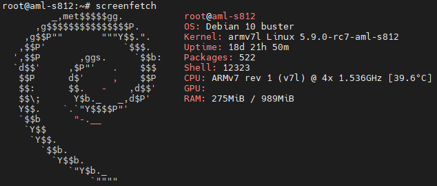
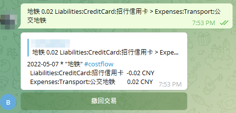

# 玩客云

捡垃圾，40块钱还行，民间大佬弄出了刷Linux的方法，可惜是32位，不过也凑合用，比斐讯N1折腾了那么一点。



## beancount

beancount介绍可以看下面几个文章，整挺好。之前是用ios端的Moze3，感觉还是差了点意思。

[Beancount复式记账（一）：为什么](https://byvoid.com/zhs/blog/beancount-bookkeeping-1/)

[复式记账指北（三）：如何打造不半途而废的记账方案](https://blog.kaaass.net/archives/1700)

[使用 Beancount 管理家庭财务 · 构建我的被动收入](https://www.bmpi.dev/self/beancount-my-accounting-tool-v2/)

[使用 Costflow 提高 Beancount 记账效率](https://medium.com/leplay/%E4%BD%BF%E7%94%A8-costflow-%E6%8F%90%E9%AB%98-beancount-%E8%AE%B0%E8%B4%A6%E6%95%88%E7%8E%87-bdae22d1f6c4)

## bot-docker

这里推荐使用kaaass/beancount_bot_costflow_docker，参考上面第二篇文章，里面有详细说明。不过上面的镜像只支持64位，只能自己弄32位的docker镜像。

### Dockerfile

从beancount_bot_costflow_docker的Dockerfile修改而来

```shell
FROM alpine:3.6

WORKDIR /app
ADD requirements.txt /app

ENV PYTHONUNBUFFERED=1
RUN apk add --update --no-cache python3 python3-dev && ln -sf python3 /usr/bin/python
RUN python3 -m ensurepip
RUN pip3 install --no-cache --upgrade pip setuptools

RUN apk add --update --no-cache --virtual .build-deps gcc libc-dev libxml2-dev libxml2 libxslt-dev py3-lxml && \
    pip install --no-cache-dir -r requirements.txt && \
        apk del .build-deps

RUN apk add --no-cache libgcc libstdc++ curl
RUN curl -fLO https://github.com/oznu/alpine-node/releases/download/14.18.1/node-v14.18.1-linux-arm-alpine.tar.gz
RUN tar -xzf node-v14.18.1-linux-arm-alpine.tar.gz -C /usr --strip-components=1 --no-same-owner
RUN rm -rf node-v14.18.1-linux-arm-alpine.tar.gz

RUN node --version

VOLUME ["/config", "/bean"]

ENV BEANCOUNT_BOT_CONFIG /config/beancount_bot.yml
ENV PYTHONPATH /config

ADD docker-entrypoint.sh /app
CMD ["/app/docker-entrypoint.sh"]
```

这里用alpine:3.6的原因是3.6以上版本有联网问题，不知道是不是32位系统的问题。不过用了3.6版本需要自己安装Python3和nodejs，也算是小麻烦了点。

### build

因为玩客云的CPU架构是armv7，所以docker build的时候需要指定一下

```shell
docker build --platform=linux/arm/v7 -t bctg .
```

### run

```shell
docker run -d --restart=always --network=host -v $PWD/bean:/bean -v $PWD/config:/config --name bctg -v /etc/localtime:/etc/localtime:ro bctg
```

这里映射了localtime文件，主要是让docker的时间和host的时间一样，因为脚本记录的时候需要获取当前时间。

使用host network模式主要是为了设置proxy

## 配置

### beancount_bot.yml

这里配置主要是删除掉了一些自己目前用不上的功能。因为主要用costflow语法，所以把template的功能也关闭了。

```yml
log:
  # 日志等级
  level: 'INFO'

bot:
  # 代理
  proxy: '127.0.0.1:8118'

  # Telegram 机器人 Token
  token: ''

  # 鉴权用令牌。第一次进入机器人时用于校验身份
  auth_token: ''

  # 机器人会话文件路径
  session_file: '/config/bot.session'

transaction:
  # 账本文件。可以使用：{year}、{month}、{date}
  beancount_file: '/bean/{year}/{month}.bean'

  # 消息处理器
  message_dispatcher:
    # 模板
    # - class: 'beancount_bot.builtin.TemplateDispatcher'
    #   args:
    #     template_config: '/config/template.yml'
    # Costflow
    - class: 'beancount_bot_costflow.CostflowDispatcher'
      args:
        costflow_config: '/config/costflow.json'

# schedule:
  # 定时任务定义
  # name：定时任务名，可以用 /task name 主动触发
  # class：定时任务类
  # args：创建任务需要的参数

  # 定时任务示例：定时更新价格
  # 使用内建任务类：beancount_bot.builtin.DailyCommandTask
  # 该类在每日 time 时执行指令，之后广播 message 消息
  # - name: price
  #   class: 'beancount_bot.builtin.DailyCommandTask'
  #   args:
  #     time: '21:30'
  #     message: '当日价格更新完成'
  #     commands:
  #       - 'bean-price /bean/main.bean >> /bean/automatic/prices.bean'

```

### costflow.json

这个就相对简单一点，因为我觉得设置account的缩写比较难看，所以这里就没用到account的功能。

```shell
{
    "mode": "beancount",
    "currency": "CNY",
    "tag": "#costflow",
    "defaultAccount":  "Liabilities:CreditCard:招行信用卡",
    "alphavantage": null,
    "indent": 2,
    "lineLength": 50
}
```

## 效果



```shell
2022-05-07 * "地铁" #costflow
  tgbot_time: "2022-05-07 19:53:17.985351"
  tgbot_uuid: "230a4246-b864-495d-8510-ed6f8da75cf1"
  Liabilities:CreditCard:招行信用卡                       -0.02 CNY
  Expenses:Transport:公交地铁
```

这里的tgbot_time暂时没有除修改代码外的方法去除，不过也不碍事，留个记录怕到时候tg的消息找不到。
