# 组成
 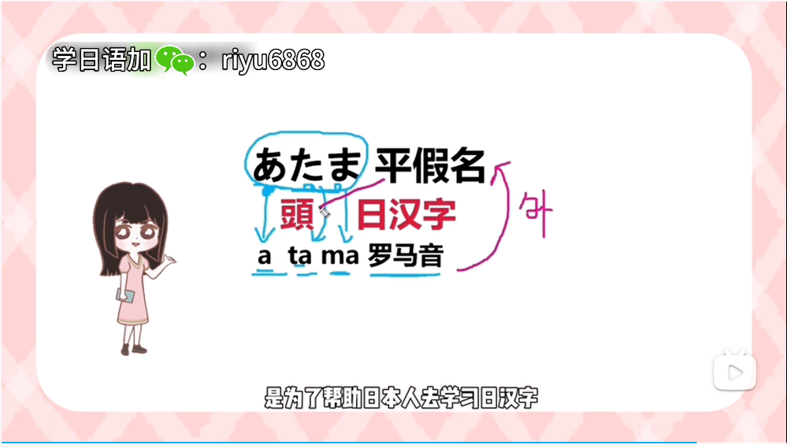
- **日汉字**：借鉴汉字写法和意思，没有倍鉴发音。同字不同音，写法一样，意思一样，发音不同。
- **平假名**：假在古代有借的意思，假借中国文字演变而来的。日语五十音图共有 46 个假名，其中四个是重复的。用于类似拼音拼读日汉字，帮助日本人学习日汉字。
- **罗马音**：帮助外国人学习日语时候拼读平假名，不完全按照中文拼音读法。
# 日语汉字
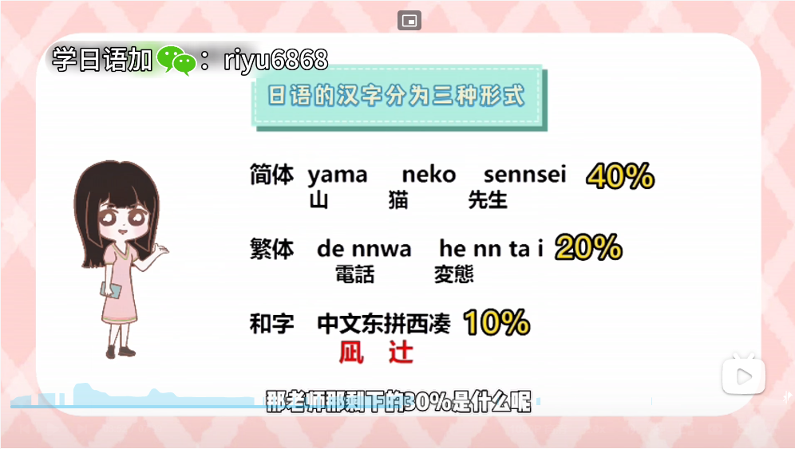

- 片假名：用于拼读外来文，代表片面，取汉字偏旁部首。
- 平假名：平滑圆润，非常 Q 弹。
- 区别：类似英文字母 Ab，发音一样，写法不同，用法不同。
# 五十音
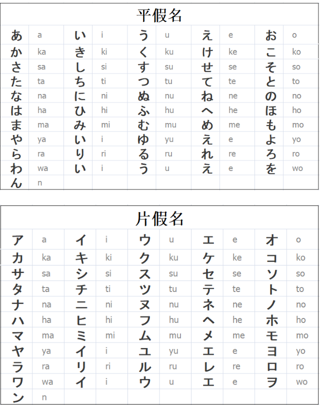

## 韵母
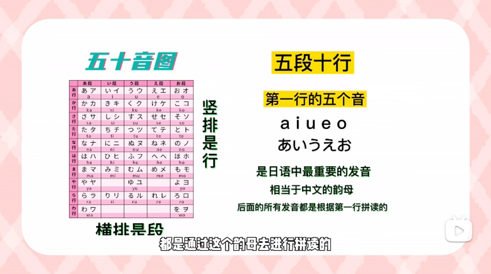

## さ行
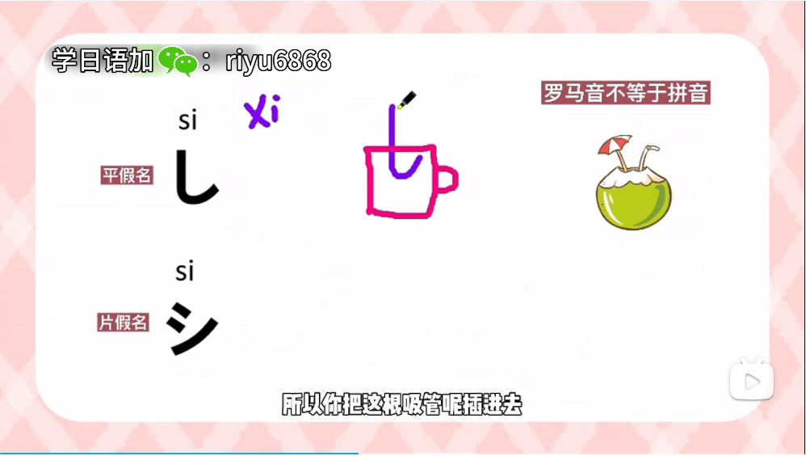

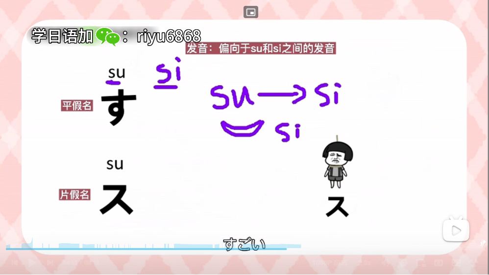

- せ：sei
- そ：嗦粉，不是搜索
## た行
ち：qi
つ：ci
## や行
ゆ： u
## ら行
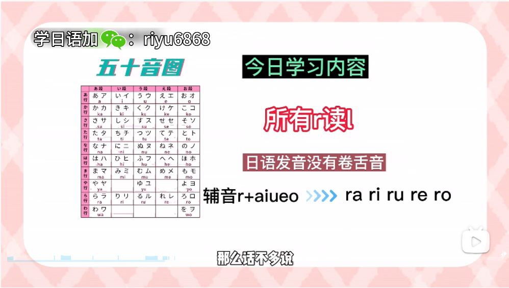

## わ行
を：o

- ん：闭着嘴巴发嗯的鼻音，一般都是和别的词连用
# 促音
停促一拍，不发音
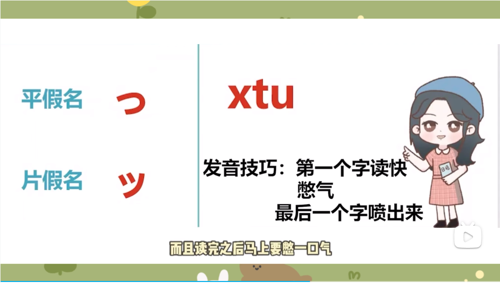

# 拗音

- 一大一小组成在一起

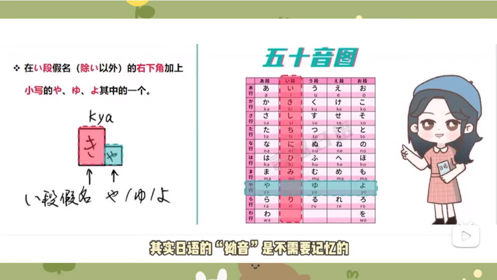
读音类似中文 xi+ao=xiao

# 浊音半浊音
- 背景：类似中文一个字在不同的具体有不同的音调，只是在日语中是不同的发音
- 右上角：两点（浊音）
- 右上角：圈圈（半浊音）
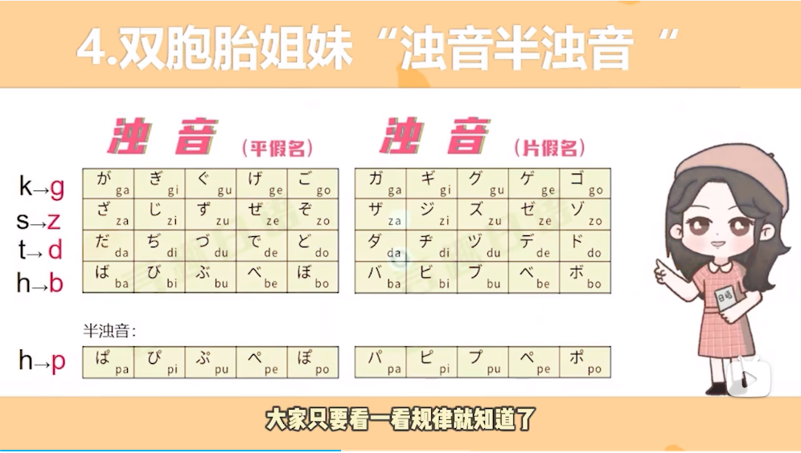
# 长音
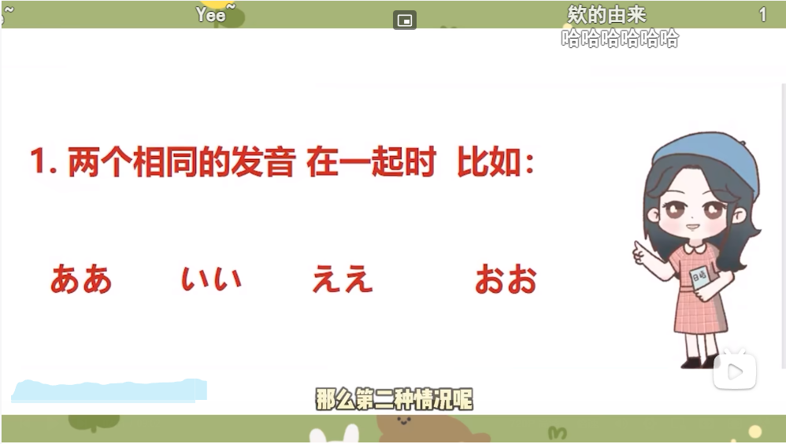
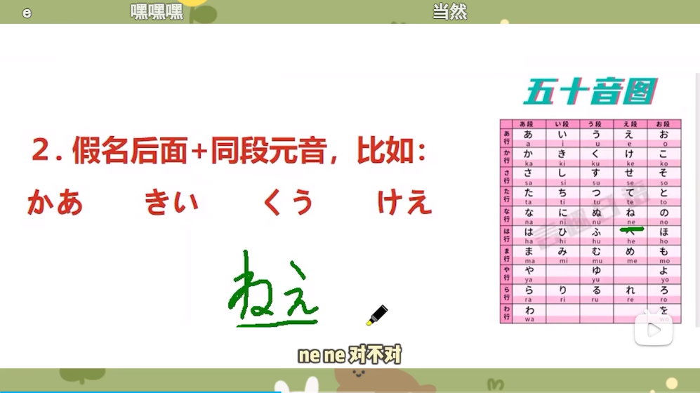
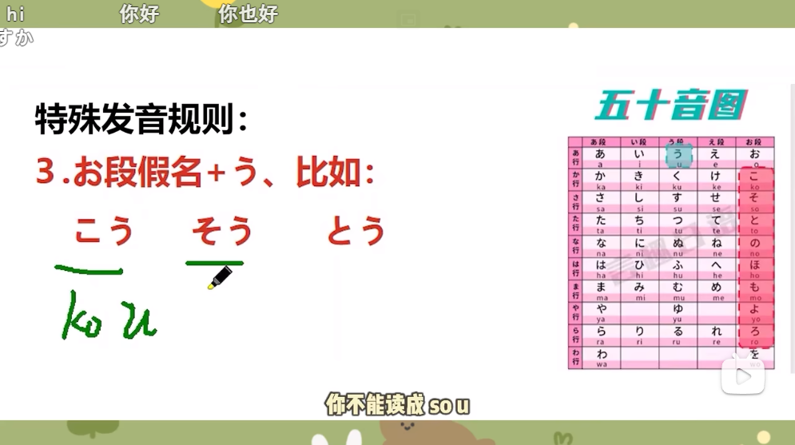
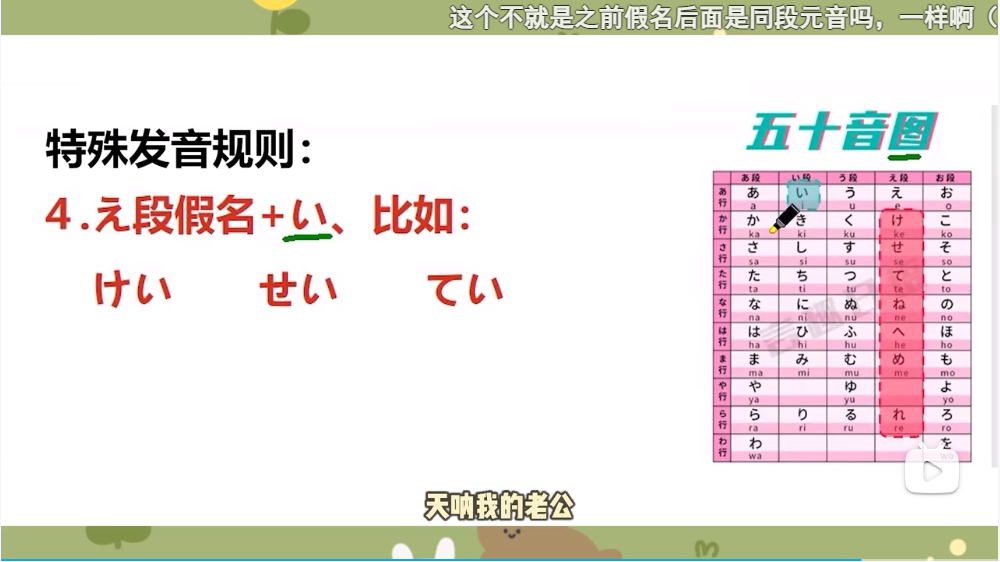
# 音调
只有两个音：低音和高音
低音：接近于拼音第三声ǎ
高音：接近于拼音第一声 a
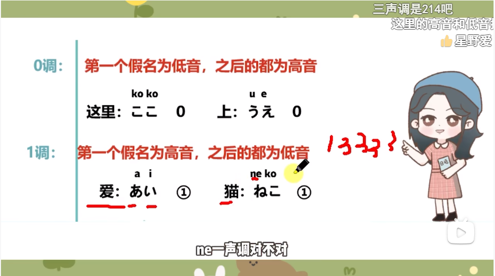
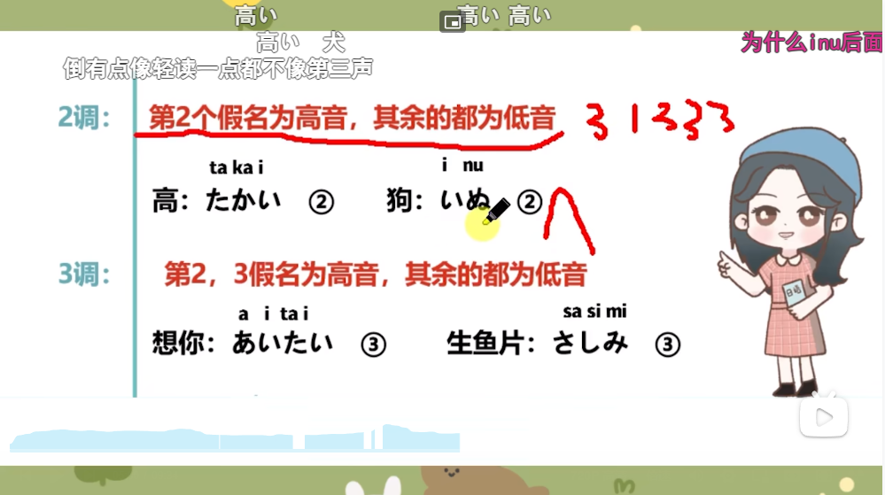
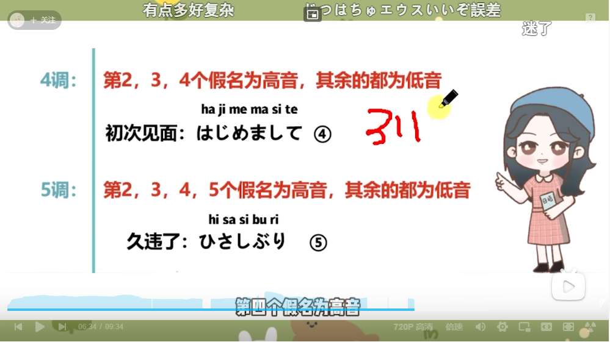
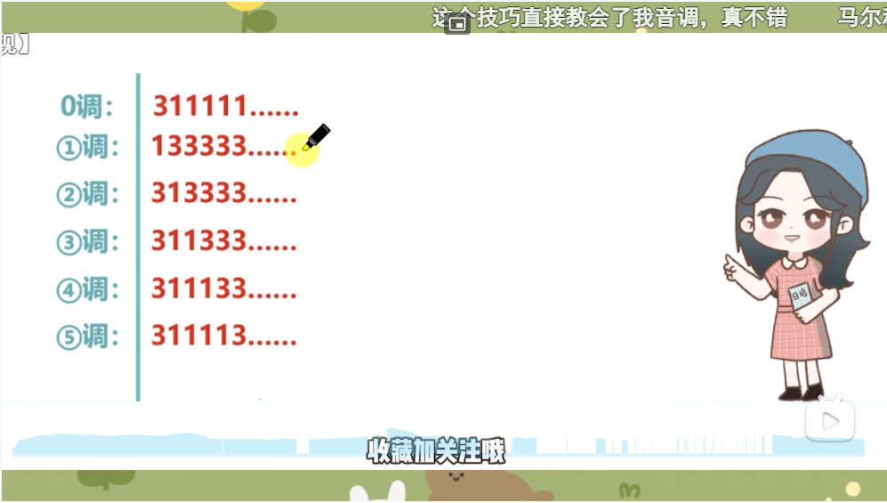
